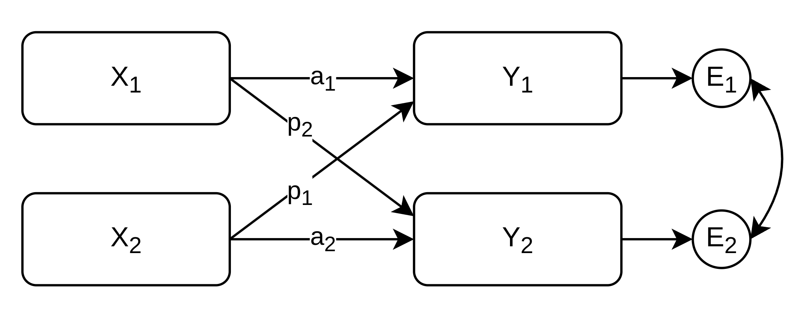
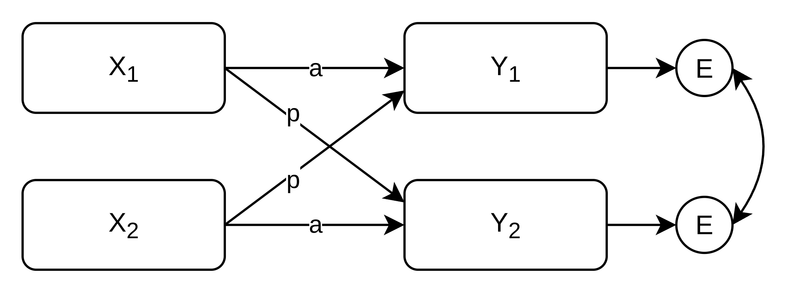
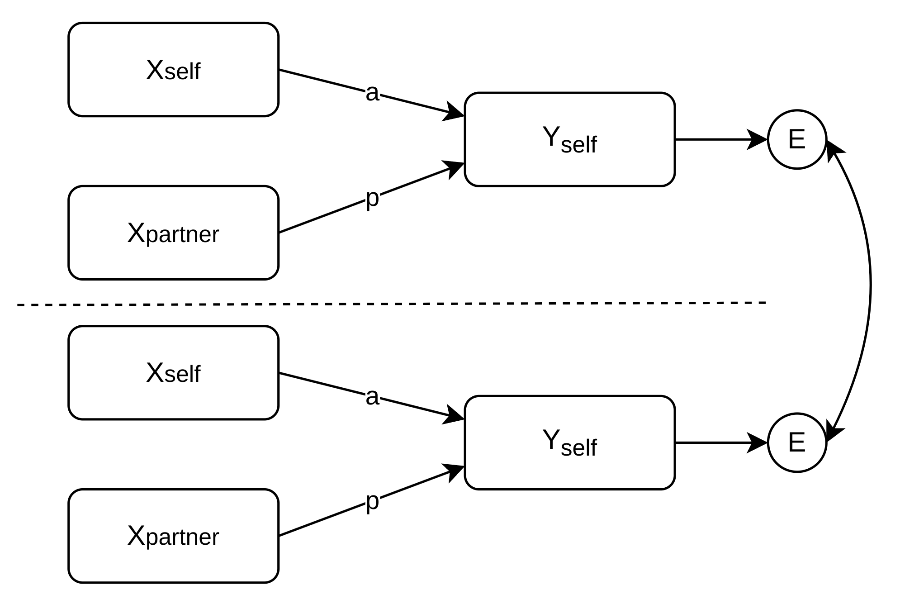

```{r setup, include=FALSE}
knitr::opts_chunk$set(echo = TRUE)
rm(list = ls())
gc()
library(glue)
```

## Overview

* Distinguishable Dyads
  * Cross-Sectional APIM
  * Longitudinal APIM
  
* Exchangeable Dyads
  * Cross-Sectional APIM
  * Cross-Sectional DIM
  * Equivalence between APIM and DIM
  * Longitudinal DIM
  * Longitudinal APIM
  
## Loading Libraries and setting CmdStan Backend

Some functions used in this presentation are sourced from the files available
in the folder 00_R_Functions.

```{r load-libraries, results='hide', message=FALSE, warning=FALSE}
library(tidyverse)
library(brms)
library(glmmTMB)
library(bmlm)
library(easystats)
library(DiagrammeR)
library(DHARMa)
library(MASS)
library(purrr)
source(file.path('00_R_Functions', 'ReportModels.R'))
source(file.path('00_R_Functions', 'PrettyTables.R'))
source(file.path('00_R_Functions', 'PrepareData.R'))

options(
  brms.backend = 'cmdstan',
  brms.file_refit = 'on_change'
)
```


```{r simulate-cross-sectional-data, echo=FALSE, results='hide'}
# --- Packages (explicit namespacing avoids conflicts) ---
set.seed(123)

# --- 1. Define Simulation Parameters ---
# Sample Size
n_het <- 550 # Number of heterosexual couples
n_ss  <- 400 # Number of same-sex couples
n_total <- n_het + n_ss

# Residual SDs by gender / dyad type (unchanged)
sd_e_het_female <- 1.1
sd_e_het_male   <- 1.4
sd_e_ss_female  <- 0.9   # (SS individuals coded female in this example)
# sd_e_ss_male <- ...    # if you add male–male couples

# --- NEW: Residual correlations by dyad type (compound symmetry) ---
rho_e_het <- 0.30
rho_e_ss  <- 0.40

# Fixed Effects (the "true" values we want to recover)
gamma_0_het_female <- 5.5
gamma_0_het_male   <- 4.5
gamma_0_ss_person  <- 5.35

gamma_a_het_female <- 1.6
gamma_a_het_male   <- 1.8
gamma_a_ss_person  <- 0.2

gamma_p_het_female <- 0.3
gamma_p_het_male   <- 0.2
gamma_p_ss_person  <- 0.25

# Variance Components
sd_x <- 1.5      # SD of the predictor (communication)
r_x  <- 0.4      # Correlation between partners' communication

# --- UPDATED: smaller, more realistic random slope SDs ---
# (Feel free to tweak; these are modest to reflect heterogeneity without dominating)
sd_u0j <- 0.8    # baseline random intercept SD (unused directly below; see group-specific)
sd_uaj <- 0.15   # (legacy overall; using group-specific below)
sd_upj <- 0.12
cor_u0a <- 0.20
cor_u0p <- 0.15
cor_uap <- -0.10
sd_e    <- 1.2   # legacy scalar residual SD (not used now that we do sex-specific)

# --- 2. Simulate Dyad-Level Variables ---
dyad_data <- tibble::tibble(coupleID = 1:n_total)

# -- 2a: SEPARATE variance components for each group (UPDATED slopes) --

# Heterosexual couples
sd_u0j_het <- 0.8
sd_uaj_het <- 0.15   # was 0.3
sd_upj_het <- 0.12   # was 0.2
cor_u0a_het <- 0.20  # was 0.25
cor_u0p_het <- 0.15  # same
cor_uap_het <- -0.10 # same

# Same-sex couples
sd_u0j_ss <- 1.0
sd_uaj_ss <- 0.12   # was 0.2
sd_upj_ss <- 0.15   # was 0.25
cor_u0a_ss <- 0.10
cor_u0p_ss <- -0.05
cor_uap_ss <- 0.00

# -- 2b: Variance-covariance matrices --
cov_matrix_u_het <- matrix(c(
  sd_u0j_het^2,                      cor_u0a_het*sd_u0j_het*sd_uaj_het, cor_u0p_het*sd_u0j_het*sd_upj_het,
  cor_u0a_het*sd_u0j_het*sd_uaj_het, sd_uaj_het^2,                      cor_uap_het*sd_uaj_het*sd_upj_het,
  cor_u0p_het*sd_u0j_het*sd_upj_het, cor_uap_het*sd_uaj_het*sd_upj_het, sd_upj_het^2
), nrow = 3, byrow = TRUE)

cov_matrix_u_ss <- matrix(c(
  sd_u0j_ss^2,                     cor_u0a_ss*sd_u0j_ss*sd_uaj_ss, cor_u0p_ss*sd_u0j_ss*sd_upj_ss,
  cor_u0a_ss*sd_u0j_ss*sd_uaj_ss,  sd_uaj_ss^2,                   cor_uap_ss*sd_uaj_ss*sd_upj_ss,
  cor_u0p_ss*sd_u0j_ss*sd_upj_ss,  cor_uap_ss*sd_uaj_ss*sd_upj_ss, sd_upj_ss^2
), nrow = 3, byrow = TRUE)

# -- 2c: Generate random effects separately for each group --
random_effects_het <- MASS::mvrnorm(n = n_het, mu = c(0, 0, 0), Sigma = cov_matrix_u_het)
random_effects_ss  <- MASS::mvrnorm(n = n_ss,  mu = c(0, 0, 0), Sigma = cov_matrix_u_ss)

# -- 2d: Combine into one dataframe --
het_df_re <- tibble::tibble(
  coupleID = 1:n_het,
  u_0j = random_effects_het[, 1],
  u_aj = random_effects_het[, 2],
  u_pj = random_effects_het[, 3]
)

ss_df_re <- tibble::tibble(
  coupleID = (n_het + 1):n_total,
  u_0j = random_effects_ss[, 1],
  u_aj = random_effects_ss[, 2],
  u_pj = random_effects_ss[, 3]
)

combined_re <- dplyr::bind_rows(het_df_re, ss_df_re)

# Generate correlated predictor scores for partners (same as before)
cov_matrix_x <- matrix(c(sd_x^2, r_x*sd_x^2, r_x*sd_x^2, sd_x^2), nrow = 2)
partner_scores <- MASS::mvrnorm(n = n_total, mu = c(5, 5), Sigma = cov_matrix_x)

# Join combined RE with main dyad data
dyad_data <- dyad_data %>%
  dplyr::mutate(
    communication_p1 = partner_scores[, 1],
    communication_p2 = partner_scores[, 2]
  ) %>%
  dplyr::left_join(combined_re, by = "coupleID")

# --- 3. Create Person-Level (Long) Dataframe ---
person1 <- dyad_data %>% dplyr::select(coupleID, communication = communication_p1) %>% dplyr::mutate(p_num = 1)
person2 <- dyad_data %>% dplyr::select(coupleID, communication = communication_p2) %>% dplyr::mutate(p_num = 2)

df <- dplyr::bind_rows(person1, person2) %>%
  dplyr::arrange(coupleID, p_num) %>%
  dplyr::mutate(userID = paste0(coupleID, "_", p_num)) %>%
  dplyr::select(userID, coupleID, communication, p_num)

# Assign gender (1 = female, 2 = male)
het_couples <- 1:n_het
ss_couples  <- (n_het + 1):n_total

df <- df %>%
  dplyr::mutate(
    gender = dplyr::case_when(
      coupleID %in% het_couples & p_num == 1 ~ 1,
      coupleID %in% het_couples & p_num == 2 ~ 2,
      coupleID %in% ss_couples               ~ 1
    )
  )

temp_df_for_outcome <- df %>%
  dplyr::group_by(coupleID) %>%
  dplyr::mutate(
    communication_actor   = communication,
    communication_partner = communication[2:1]
  ) %>%
  dplyr::ungroup() %>%
  dplyr::left_join(dyad_data, by = "coupleID") %>%
  dplyr::mutate(
    # Center predictors before generating outcome (grand-mean)
    c_comm_actor   = communication_actor   - mean(communication_actor),
    c_comm_partner = communication_partner - mean(communication_partner),

    # Deterministic part
    satisfaction_deterministic = dplyr::case_when(
      gender == 1 & coupleID <= n_het ~ gamma_0_het_female + gamma_a_het_female * c_comm_actor + gamma_p_het_female * c_comm_partner,
      gender == 2 & coupleID <= n_het ~ gamma_0_het_male   + gamma_a_het_male   * c_comm_actor + gamma_p_het_male   * c_comm_partner,
      gender == 1 & coupleID >  n_het ~ gamma_0_ss_person  + gamma_a_ss_person  * c_comm_actor + gamma_p_ss_person  * c_comm_partner
    )
  )

# --- NEW: Residuals with compound symmetry (per dyad) & sex-specific SDs -------
resid_pairs <- tibble::tibble(coupleID = 1:n_total) %>%
  dplyr::mutate(
    sd1 = ifelse(coupleID <= n_het, sd_e_het_female, sd_e_ss_female),  # p1: het=female, ss=female
    sd2 = ifelse(coupleID <= n_het, sd_e_het_male,   sd_e_ss_female),  # p2: het=male,   ss=female
    rho = ifelse(coupleID <= n_het, rho_e_het,       rho_e_ss)
  ) %>%
  dplyr::rowwise() %>%
  dplyr::mutate(
    e_pair = list(MASS::mvrnorm(
      n = 1, mu = c(0, 0),
      Sigma = matrix(c(sd1^2, rho*sd1*sd2,
                       rho*sd1*sd2, sd2^2), nrow = 2)
    ))
  ) %>%
  dplyr::ungroup() %>%
  tidyr::unnest_wider(e_pair, names_sep = "") %>%
  dplyr::rename(e1 = e_pair1, e2 = e_pair2)

# Attach residuals and finish outcome
temp_df_for_outcome <- temp_df_for_outcome %>%
  dplyr::left_join(resid_pairs, by = "coupleID") %>%
  dplyr::mutate(
    e_i = ifelse(p_num == 1, e1, e2),
    satisfaction = satisfaction_deterministic +
      u_0j + (u_aj * c_comm_actor) + (u_pj * c_comm_partner) + e_i
  ) %>%
  dplyr::select(-e1, -e2)

# Finalize: ORIGINAL OUTPUT FORMAT
df <- temp_df_for_outcome %>%
  dplyr::select(userID, coupleID, gender, communication, satisfaction)

```


# Distinguishable Dyads

## Distinguishable Dyads - Cross-Sectional APIM 

## Distinguishable Dyads - Data: Simulated Dyads

```{r data-dist-apim-raw-preview}
print_df(head(df))
```


```{r data-dist-apim-filter-dyads, results='hide', echo=FALSE, message=FALSE}
# subsetting distinguishable dyads
df_filt <- df %>%
  reshape_dyadic_data(
    person_id = 'userID',
    dyad_id = 'coupleID',
    vars_to_reshape = c('communication', 'gender')
  )  

df <- df[df_filt$gender_actor != df_filt$gender_partner, ]

```

## Distinguishable Dyads - Cross-Sectional APIM


[e.g., @kenny2006dyadic; @kennyPartnerEffectsRelationship1999; @kennyDyadicDataAnalysis2011]


## Distinguishable Dyads - Preparing Data

```{r data-dist-apim-prepare, results='hide', message=FALSE, warning=FALSE}
df_apim <- df %>%
  # Reshaping to Actor-Partner format (4-field)
  reshape_dyadic_data(
    person_id = 'userID',
    dyad_id = 'coupleID',
    vars_to_reshape = 'communication'
  )  %>%
  mutate(
    # Optional: grand-mean centering
    communication_actor_gmc = communication_actor - mean(communication_actor),
    communication_partner_gmc = communication_partner - mean(communication_partner),
    
    # Create Dummy-Variables for male and female
    is_female = ifelse(gender == 1, 1, 0),
    is_male = ifelse(gender == 2, 1, 0),
  ) 

print_df(head(df_apim))

```


```{r data-dist-apim-relocate-indicators, echo = FALSE, results='hide', message = FALSE, warning= FALSE, error=FALSE}
# Selecting only distinguishable Dyads

df_apim <- relocate(df_apim, 'is_male', 'is_female', .after = 'gender')

```

## Distinguishable Dyads - Preparing Data

```{r data-dist-apim-preview, echo=FALSE}

print_df(head(df_apim))

```


## Distinguishable Dyads - Fitting the Model in glmmTMB

- `glmmTMB` usually models the residual structure via the `dispformula` argument.
However, this does not provide us with enough flexibility for our usecase.

- However, in glmmTMB specifically, we can suppress the modelling of the residual structure by setting `dispformula = ~ 0`.

- This forces the residual variance into the random effects. The random effects block now becomes the residual variance covariance structure.

- In glmmTMB, random effects with various covariance structures can be specified, giving us enormous control over the covariance structure of the residuals.

## Distinguishable Dyads - Fitting the Model in glmmTMB

```{r fit-dist-apim-glmmtmb, results='hide', message=FALSE, warning=FALSE}
#| code-line-numbers: "1-13|15-16|18-22"
model_dist_apim_glmmtmb <- glmmTMB(
  satisfaction ~ 
    
    # Remove global intercept, introduce male and female intercepts.
    0 + is_male + is_female +
    
    # Actor effect for male and female
    communication_actor_gmc:is_male + 
    communication_actor_gmc:is_female + 
    
    # Partner effect for male and female
    communication_partner_gmc:is_male + 
    communication_partner_gmc:is_female +
  
    # Modelling residual non-independence with an unstructured 2x2 covariance. 
    us(0 + is_male + is_female | coupleID)
  
    # Since we model residual covariance via this random-effects block, glmmTMB requires us to remove an 
    # additional independent residual
    , dispformula = ~ 0
  
    , data = df_apim
)

```


- Note that 'unstructured' is the default in glmmTMB, so instead of `us(0 + is_male + is_female | coupleID)`, we could also remove `us` and simply write `(0 + is_male + is_female | coupleID)`.

## Distinguishable Dyads - Fitting the Model in glmmTMB

```{r results-dist-apim-glmmtmb, echo=FALSE, class.output='model-summary-output'}

summary(model_dist_apim_glmmtmb)

```

## glmmTMB: Current limitation

Usually, simulation-based tools like DHARMa [@R-DHARMa] are great for residual diagnostics in complex (generalized) MLMs. 

However, when we remove the native residuals `dispformula = ~ 0` the residual is, in practice, set to a tiny constant. This confuses model diagnostic packages! 

Therefore, residuals need to be manually simulated and compared.


## Distinguishable Dyads - Fitting the Model in brms

In brms, we cannot use the glmmTMB trick and disable the internal modelling of the residual variance. Instead, we must rely on brms-provided residual covariance structures. We can achieve the same model via:

```{r fit-dist-apim-brms, results='hide', message=FALSE, warning=FALSE}
#| code-line-numbers: "1-13|15-21|24-29|31-41"
formula_dist_apim_b <- bf(
  satisfaction ~ 
    
    # Remove global intercept, introduce male and female intercepts.
    0 + is_male + is_female +
    
    # Actor effect for male and female
    communication_actor_gmc:is_male + 
    communication_actor_gmc:is_female + 
    
    # Partner effect for male and female
    communication_partner_gmc:is_male + 
    communication_partner_gmc:is_female +
  
    # Modelling residual correlation. With two partners and sex-specific sigma,
    # this gives the needed two variances and one correlation for this example.
    cosy(gr = coupleID),
  
  # Allowing two distinct residual variances for males vs females:
  sigma = ~ 0 + is_male + is_female
)

priors_dist_apim_b <- c(
  # prior(normal(2, 3), class = "Intercept"),
  prior(normal(0, 5), class = "b"),
  prior(student_t(3, 0, 1.5), class = "b", dpar = "sigma"),
  prior(beta(1, 3), class = "cosy")
)

model_dist_apim_b <- brm(
  formula = formula_dist_apim_b,
  data = df_apim,
  family = gaussian(link = identity),
  prior = priors_dist_apim_b,
  chains = 4,
  cores = 4,
  iter = 2000,
  warmup = 1000, 
  seed = 123,
  file = file.path('brms_cache', 'example1_dist_apim_b') # Cache the model
)


```


## Distinguishable Dyads - Check Model Convergence and Fit

Check Rhats and Effective Sample Sizes (ESS_tail and ESS_bulk) directly from the brms summary. Additionally you can (using Model B as an example):

```{r cache = TRUE, message=TRUE}
rstan::check_hmc_diagnostics(model_dist_apim_b$fit)
loo::pareto_k_table(loo(model_dist_apim_b))
```

## Distinguishable Dyads - Check Model Convergence and Fit


```{r eval=FALSE}
plot(model_dist_apim_b, ask = FALSE)
```

```{r echo=FALSE}
p1 <- plot(model_dist_apim_b, ask=FALSE, nvariables = 3, plot = FALSE)
p1[[2]] # Look at ALL parameters, here only a subset of 3 is printed for slides
```
## Distinguishable Dyads - Check Model Convergence and Fit

```{r cache = TRUE}
pp_check(model_dist_apim_b, 'dens_overlay_grouped', group = 'is_male')
```

## Distinguishable Dyads - Check Model Convergence and Fit

```{r cache = TRUE}
pp_check(model_dist_apim_b, 'ecdf_overlay_grouped', group = 'is_male')
```

## Distinguishable Dyads - Check Model Convergence and Fit

```{r cache = TRUE}
pp_check(model_dist_apim_b, type = "loo_pit_overlay")
```

## Distinguishable Dyads - Check Model Convergence and Fit

```{r cache = TRUE}
# Custom function to make DHARMa work with brms (see file 'Functions')
DHARMa.check_brms(model_dist_apim_b)
```

## Distinguishable Dyads - Check Model Convergence and Fit

In case of non-convergence, bad residuals or low predictive accuracy, the model is likely miss-specified. 

You can try different families that match your data by using the `family` argument. For instance, you can easily conduct an ordinal regression by simply setting `family = cumulative()` and adjusting your priors. For dichotomous outcomes you can use `family = bernoulli()`. brms supports a variety of families and link functions for these families. In general, you should use the default link function (check `?brms::family.brmsfit()`). 

Note that for some of the later models in this tutorial, some ESS values are too low. In this case, usually we would increase iterations (and warmup), and/or adapt_delta (see brms documentation). 


## Distinguishable Dyads - Results

```{r results-dist-apim-brms, echo = FALSE}

summary_dist_apim_b <- summarize_brms(
    model_dist_apim_b, 
    exponentiate_sigma = TRUE,
    stats_to_report = c('CI', 'Rhat', 'ESS')
    )

print_df(
  summary_dist_apim_b,
  rows_to_pack = list(
    'Fixed Effects' = c(1,6),
    'Residual Structure' = c(7,9)
    )
  )

```

CAREFUL: In contrast to glmmTMB, brms estimates sigma on the log scale (see `?brms::family.brmsfit()`). In the table above, sigma rows are exponentiated to show residual SDs on the response scale and to align with the glmmTMB model. 

## Distinguishable Dyads - (Intensive) Longitudinal APIM

## Distinguishable Dyads - L-APIM - Simulated Dataset

```{r simulate-longitudinal-data, echo=FALSE, results='hide'}
# Simulate Data
set.seed(123)

# ===============================
# 1) Design
# ===============================
n_couples <- 100
days      <- 0:54 
T_per     <- length(days)

# People per couple: p1 = female, p2 = male
persons <- tibble(
  coupleID  = rep(1:n_couples, each = 2),
  p_num     = rep(1:2, times = n_couples),
  gender    = ifelse(p_num == 1, 1L, 2L),  # 1=female, 2=male
  is_female = as.integer(gender == 1L),
  is_male   = as.integer(gender == 2L),
  userID    = paste0(coupleID, "_", p_num)
)

# ===============================
# 2) Fixed effects (edit as desired)
# ===============================
# Intercepts & time trends by gender
b0_female <- 5.5; b0_male <- 4.7 # depends on centering, not meaningful when recovered. 
b_time_female <-  0.01; b_time_male <- -0.005 # must be small because over 55 days!

# Between-person APIM (effects of person-mean support)
b_bp_actor_f <- 1.5; b_bp_partner_f <- 0.5
b_bp_actor_m <- 1.2; b_bp_partner_m <- 0.3

# Within-person APIM (effects of daily deviations)
b_wp_actor_f <- 0.4; b_wp_partner_f <- 0.2
b_wp_actor_m <- 0.2; b_wp_partner_m <- 0.1 # hard to detect!

# ===============================
# 3) Couple-level random effects (full var-cov)
#    Vector: [b0_m, b0_f, time_m, time_f, wpA_m, wpP_m, wpA_f, wpP_f]
# ===============================
sd_re <- c(0.70, 0.80, 0.015, 0.015, 0.10, 0.08, 0.10, 0.08)
R     <- matrix(0.15, 8, 8); diag(R) <- 1
Sigma_re <- diag(sd_re) %*% R %*% diag(sd_re)

RE <- MASS::mvrnorm(n_couples, mu = rep(0, 8), Sigma = Sigma_re) |>
  as_tibble(.name_repair = ~c("re_b0_m","re_b0_f","re_time_m","re_time_f",
                              "re_wpA_m","re_wpP_m","re_wpA_f","re_wpP_f")) |>
  mutate(coupleID = 1:n_couples)

# ===============================
# 4) Provided support (predictor)
#    - Person means correlated within couple
#    - Daily AR(1) within-person; cross-partner correlated innovations
# ===============================
mu_sup_f <- 5.0; sd_mu_f <- 0.8
mu_sup_m <- 4.8; sd_mu_m <- 0.8
rho_couple_mean <- 0.50
Sigma_mu <- matrix(c(sd_mu_f^2, rho_couple_mean*sd_mu_f*sd_mu_m,
                     rho_couple_mean*sd_mu_f*sd_mu_m, sd_mu_m^2), 2)

mu_pairs <- MASS::mvrnorm(n_couples, mu = c(mu_sup_f, mu_sup_m), Sigma = Sigma_mu)

mu_df <- tibble(
  coupleID = rep(1:n_couples, each = 2),
  p_num    = rep(1:2, times = n_couples),
  mu_sup   = c(rbind(mu_pairs[,1], mu_pairs[,2]))
)

phi_sup <- 0.4
sd_sup_wp  <- 0.8
sd_eta_sup <- sqrt(sd_sup_wp^2 * (1 - phi_sup^2))
rho_sup_day <- 0.3
Sigma_eta_day <- matrix(c(sd_eta_sup^2, rho_sup_day*sd_eta_sup^2,
                          rho_sup_day*sd_eta_sup^2, sd_eta_sup^2), 2)

sim_support_one_couple <- function(cid) {
  eta <- MASS::mvrnorm(T_per, mu = c(0,0), Sigma = Sigma_eta_day)
  sup <- matrix(NA_real_, nrow = T_per, ncol = 2)
  sup[1,] <- eta[1,] / sqrt(1 - phi_sup^2)  # stationary init
  for (t in 2:T_per) sup[t,] <- phi_sup * sup[t-1,] + eta[t,]
  tibble(coupleID = cid, diaryday = days, sup_f = sup[,1], sup_m = sup[,2])
}

support_time <- purrr::map_dfr(1:n_couples, sim_support_one_couple)

support_long <- support_time |>
  tidyr::pivot_longer(c(sup_f, sup_m), names_to = "who", values_to = "sup_cwp") |>
  dplyr::mutate(p_num = ifelse(who == "sup_f", 1L, 2L)) |>
  dplyr::select(-who) |>
  dplyr::left_join(mu_df, by = c("coupleID","p_num")) |>
  dplyr::mutate(provided_support = mu_sup + sup_cwp) |>
  dplyr::select(coupleID, diaryday, p_num, provided_support, sup_cwp)

# ===============================
# 5) Assemble panel & partner lookups (safe keys)
# ===============================
panel <- tidyr::expand_grid(coupleID = 1:n_couples, diaryday = days, p_num = 1:2) |>
  dplyr::left_join(persons, by = c("coupleID","p_num")) |>
  dplyr::left_join(support_long, by = c("coupleID","diaryday","p_num"))

panel <- panel |>
  dplyr::group_by(coupleID, diaryday) |>
  dplyr::mutate(
    provided_support_partner = provided_support[3 - p_num],
    sup_cwp_partner          = sup_cwp[3 - p_num]
  ) |>
  dplyr::ungroup()

mu_actor_tbl   <- mu_df |> dplyr::rename(mu_actor = mu_sup)
mu_partner_tbl <- mu_df |> dplyr::mutate(p_num = 3 - p_num) |> dplyr::rename(mu_partner = mu_sup)

panel <- panel |>
  dplyr::left_join(mu_actor_tbl,   by = c("coupleID","p_num")) |>
  dplyr::left_join(mu_partner_tbl, by = c("coupleID","p_num"))

# ===============================
# 6) Same-day couple×day random effect (common shocks)
# ===============================
use_day_RE <- TRUE     # set FALSE to remove same-day shock
sd_day <- 0.17
if (use_day_RE) {
  day_shock <- tidyr::expand_grid(coupleID = 1:n_couples, diaryday = days) |>
    dplyr::mutate(z_day = rnorm(n(), 0, sd_day))
  panel <- panel |> dplyr::left_join(day_shock, by = c("coupleID","diaryday"))
} else {
  panel <- panel |> dplyr::mutate(z_day = 0)
}

# ===============================
# 7) Deterministic mean of daily closeness
# ===============================
grand_mu <- mean(mu_df$mu_sup)  # single grand mean for CBP

panel <- panel |>
  dplyr::left_join(RE, by = "coupleID") |>
  dplyr::mutate(
    # fixed parts by gender
    fix_b0   = ifelse(is_male==1, b0_male, b0_female),
    fix_time = ifelse(is_male==1, b_time_male, b_time_female),
    fix_bp_actor   = ifelse(is_male==1, b_bp_actor_m,  b_bp_actor_f),
    fix_bp_partner = ifelse(is_male==1, b_bp_partner_m,b_bp_partner_f),
    fix_wp_actor   = ifelse(is_male==1, b_wp_actor_m,  b_wp_actor_f),
    fix_wp_partner = ifelse(is_male==1, b_wp_partner_m,b_wp_partner_f),

    # couple-level REs by gender
    re_b0      = ifelse(is_male==1, re_b0_m,   re_b0_f),
    re_time    = ifelse(is_male==1, re_time_m, re_time_f),
    re_wp_actor= ifelse(is_male==1, re_wpA_m,  re_wpA_f),
    re_wp_part = ifelse(is_male==1, re_wpP_m,  re_wpP_f),

    # latent components
    actor_cwp   = sup_cwp,
    partner_cwp = sup_cwp_partner,
    actor_cbp   = mu_actor   - grand_mu,
    partner_cbp = mu_partner - grand_mu,

    # deterministic mean
    mu_it =
      fix_b0 + fix_time * diaryday +
      fix_bp_actor   * actor_cbp   + fix_bp_partner * partner_cbp +
      fix_wp_actor   * actor_cwp   + fix_wp_partner * partner_cwp +
      re_b0 + re_time * diaryday +
      re_wp_actor * actor_cwp + re_wp_part * partner_cwp +
      z_day
  )

# ===============================
# 8) Residuals: AR(1) within person, gender-specific σ
# ===============================
phi_eps <- 0.10
sd_eps_f <- 0.70; sd_eps_m <- 1.10
sd_eta_f <- sqrt(sd_eps_f^2 * (1 - phi_eps^2))
sd_eta_m <- sqrt(sd_eps_m^2 * (1 - phi_eps^2))

simulate_ar1_resid <- function(n, sd_eta, phi=phi_eps) {
  e <- numeric(n)
  e[1] <- stats::rnorm(1, 0, sd = sd_eta / sqrt(1 - phi^2))
  if (n >= 2) for (t in 2:n) e[t] <- phi * e[t-1] + stats::rnorm(1, 0, sd_eta)
  e
}

# Vectorized generation per user
idx <- panel |>
  dplyr::arrange(userID, diaryday) |>
  dplyr::distinct(userID, is_male)

eps_list <- mapply(
  FUN = simulate_ar1_resid,
  n = T_per,
  sd_eta = ifelse(idx$is_male==1, sd_eta_m, sd_eta_f),
  SIMPLIFY = FALSE
)
eps_vec <- unlist(eps_list, use.names = FALSE)

panel <- panel |>
  dplyr::arrange(userID, diaryday) |>
  dplyr::mutate(e_it = eps_vec) |>
  dplyr::arrange(coupleID, diaryday, p_num)

# ===============================
# 9) Outcomes & exports
# ===============================
df_long <- panel |>
  dplyr::mutate(closeness = mu_it + e_it) |>
  dplyr::select(userID, coupleID, diaryday, gender,
                closeness, provided_support) |>
  dplyr::arrange(coupleID, userID, diaryday)

```


```{r data-dist-long-apim-reshape, echo = FALSE, results='hide', warning=FALSE, message=FALSE}

df_long_apim <- df_long %>% 
  reshape_dyadic_data(
    person_id = 'userID',
    dyad_id = 'coupleID',
    time = 'diaryday',
    vars_to_reshape = c('provided_support')
  ) %>%
  mutate(
    is_female = ifelse(gender == 1, 1, 0), 
    is_male = ifelse(gender ==2, 1, 0),
    diaryday_c = diaryday - mean(diaryday)
  ) %>% 
  dplyr::select(
    userID, coupleID, diaryday, diaryday_c, gender, is_male, is_female, closeness, provided_support_actor, provided_support_partner
  )


```


```{r data-long-preview-helper, echo = FALSE, results='hide', warning=FALSE, message=FALSE}

# Function for previev (not needed for analysis!)
print_couple_preview <- function(df, couple_id,
                                 days = 0:3) {
  # Filter/sort/select with original types
  dfc0 <- df %>%
    dplyr::filter(coupleID == couple_id) %>%
    dplyr::arrange(userID, diaryday)

  # Identify partners
  partners <- dfc0 %>%
    dplyr::distinct(userID) %>%
    dplyr::arrange(userID) %>%
    dplyr::pull(userID)

  if (length(partners) < 2)
    stop("This couple doesn't have two partners in the data.")

  # Slice by partner & day BEFORE coercion
  p1 <- dfc0 %>% dplyr::filter(userID == partners[1], diaryday %in% days)
  p2 <- dfc0 %>% dplyr::filter(userID == partners[2], diaryday %in% days)

  # Coerce everything to character explicitly (belt-and-suspenders on coupleID)
  to_chr <- function(x) x %>%
    dplyr::mutate(
      dplyr::across(where(is.numeric), ~round(., 2)), 
      dplyr::across(dplyr::everything(), as.character),
      coupleID = as.character(coupleID)
      )

  p1c <- to_chr(p1)
  p2c <- to_chr(p2)

  # 1-row "..." tibble with same columns (all character)
  colset <- names(dfc0)
  ellipsis_row <- tibble::as_tibble(setNames(rep(list("..."), length(colset)), colset))

  dplyr::bind_rows(p1c, ellipsis_row, p2c)
}


```


```{r data-dist-long-apim-preview, echo=FALSE}

print_df(print_couple_preview(df_long_apim, couple_id = "31"))  

```


## Distinguishable Dyads - L-APIM - Centering 

With repeated measures we need to center variables in order to not conflate levels of analysis:

* Between-Person: The person-mean in relation to the grand mean
* Within-Person: Daily fluctuations of an individual from their person-mean

While it may seem like we have 3-levels (couple/person/day), by including the means of both partners and their correlations in the model, all information about the couple-level (level 3) is included. This will become clear when comparing the exchangeable APIM to the DIM. We thus use a 2-level model with the dyad as the level of analysis. 


## Distinguishable Dyads - L-APIM - Centering 

```{r data-dist-long-apim-center, results='hide'}
df_long_apim <- bmlm::isolate(
  df_long_apim, 
  by = 'userID', # NOT coupleID
  value = c('provided_support_actor', 'provided_support_partner'),
  which = 'both' 
) %>%
# renaming to avoid confusion with between- and within COUPLE centred DIM variables
  rename(
    provided_support_actor_cwp = provided_support_actor_cw,
    provided_support_partner_cwp = provided_support_partner_cw,
    provided_support_actor_cbp = provided_support_actor_cb,
    provided_support_partner_cbp = provided_support_partner_cb,
  ) %>%
  # Centering time
  mutate(
    diaryday_c = scale(diaryday, center = TRUE, scale = FALSE)
  )

```


## Distinguishable Dyads - L-APIM - Model nlme

`nlme` model of this data for reference (simplified random effects structure to achieve convergence).

This package is old, but still often used and cited. So here, we briefly show it to demonstrate that we can achieve the same model with much more modern and powerful methods. 

```{r fit-dist-apim-long-nlme, cache = TRUE, eval = FALSE}
#| classes: code-45vh

library(nlme)

model1 <- lme(
  fixed = 
    # Intercepts
    closeness ~ 0 + is_male + is_female +
    
    # Time Slopes
    is_male:diaryday_c +
    is_female:diaryday_c +
    
    # Between-Person APIM
    is_male:provided_support_actor_cbp + 
    is_male:provided_support_partner_cbp +
    
    is_female:provided_support_actor_cbp + 
    is_female:provided_support_partner_cbp +
  
    # Within-Person APIM
    is_male:provided_support_actor_cwp + 
    is_male:provided_support_partner_cwp +
    
    is_female:provided_support_actor_cwp + 
    is_female:provided_support_partner_cwp,
  
  random = 
    ~ 0 + is_male + is_female 
       
    + is_male:diaryday_c + is_female:diaryday_c
   
  # in nlme we need to remove many random slopes to achieve convergence
  # alternatively, we could try to remove correlations between the slopes. 
    #+ is_male:provided_support_actor_cwp 
    #+ is_male:provided_support_partner_cwp
    #+ is_female:provided_support_actor_cwp 
    #+ is_female:provided_support_partner_cwp 
  | coupleID, 
  
  weights = varIdent(form = ~ 1 | gender), # heterogeneous residual variances
  corr = corCompSymm(form = ~ 1 | coupleID/diaryday), # compound symmetry (partner's values on each day)
  
  data = df_long_apim, 
  control = list(maxIter=1000)
)

summary(model1)

```

## Distinguishable Dyads - L-APIM - Model glmmTMB

```{r fit-dist-apim-long-glmmtmb, results='hide', message=FALSE, warning=FALSE}

model_dist_apim_long_glmmtmb <- glmmTMB(
  closeness ~ 0 + is_male + is_female +
    
    # Time Slopes
    is_male:diaryday_c +
    is_female:diaryday_c +
    
    # Between-Person APIM
    is_male:provided_support_actor_cbp + 
    is_male:provided_support_partner_cbp +
    
    is_female:provided_support_actor_cbp + 
    is_female:provided_support_partner_cbp +
  
    # Within-Person APIM
    is_male:provided_support_actor_cwp + 
    is_male:provided_support_partner_cwp +
    
    is_female:provided_support_actor_cwp + 
    is_female:provided_support_partner_cwp +
  
  # Accounting for non-independence between partners' means and trajectories 
  # and effect sensitivities via random effects:
  (0 + is_male + is_female
    + is_male:diaryday_c + is_female:diaryday_c
  | coupleID) +
    
    
  # Accounting for daily non-independence
  us(0 + is_male + is_female | coupleID:diaryday)

  # heteroscedastic residuals
  , dispformula = ~ 0
  , data = df_long_apim
)
```
Note that we could also add `us` before the first random effect term, as this is equivalent. But because the lowest-level random effects block is the one that represents the residual covariance structure, we only use it there. 

## Distinguishable Dyads - L-APIM - Model glmmTMB

```{r results-dist-apim-long-glmmtmb, echo=FALSE, class.output='model-summary-output'}
summary(model_dist_apim_long_glmmtmb)
```

## Comparing outputs between nlme and glmmTMB

Let's compare the random effects outputs to see if the models are truly equivalent. 

**nlme:**
                     StdDev     Corr                
is_male              0.83645552 is_mal is_fml is_m:_
is_female            0.90199634  0.189              
is_male:diaryday_c   0.01634796  0.544  0.033       
is_female:diaryday_c 0.01612665  0.204  0.534 -0.012
Residual             0.72170702                     

Correlation Structure: Compound symmetry
 Formula: ~1 | coupleID/diaryday 
 Parameter estimate(s):
       Rho 
0.04094751 
Variance function:
 Structure: Different standard deviations per stratum
 Formula: ~1 | gender 
 Parameter estimates:
       1        2 
1.000000 1.554608 

We need to compute the residual for each partner ourselves from the nlme output:
```{r compare-dist-long-nlme-residual-sd}
0.72170702 * 1.000000
0.72170702 * 1.554608

```


**glmmTMB:**

Random effects:

Conditional model:
 Groups            Name                 Variance  Std.Dev. Corr              
 coupleID          is_male              0.6814498 0.82550                    
                   is_female            0.7930407 0.89053   0.19             
                   is_male:diaryday_c   0.0002637 0.01624   0.55  0.03       
                   is_female:diaryday_c 0.0002571 0.01603   0.21  0.54 -0.01 
 coupleID:diaryday is_male              1.2583552 1.12176                    
                   is_female            0.5206608 0.72157  0.04              


## Distinguishable Dyads - L-APIM - Model brms

Equivalent `brms` model. 

Longitudinal brms residual priors differ by model type. Distinguishable models estimate partner-specific residual SDs via `sigma ~ 0 + is_male + is_female`; because brms models these log-sigma predictors as distributional regression coefficients, their priors use `class = "b", dpar = "sigma"`. Exchangeable longitudinal models keep one pooled residual `sigma`, so their priors use `prior(student_t(3, 0, 1.5), class = "sigma")` directly.

```{r fit-dist-apim-long-simple-brms, results='hide', message=FALSE, warning=FALSE}
#| classes: code-50vh

formula_dist_apim_long_simple <- bf(
  closeness ~ 0 + is_male + is_female +
    
    # Time Slopes
    is_male:diaryday_c +
    is_female:diaryday_c +
    
    # Between-Person APIM
    is_male:provided_support_actor_cbp + 
    is_male:provided_support_partner_cbp + 
    
    is_female:provided_support_actor_cbp + 
    is_female:provided_support_partner_cbp +
  
    # Within-Person APIM
    is_male:provided_support_actor_cwp + 
    is_male:provided_support_partner_cwp +
    
    is_female:provided_support_actor_cwp + 
    is_female:provided_support_partner_cwp +
  
  # Accounting for non-independence between partners' means and trajectories 
  # and effect sensitivities via random effects:
  (0 + is_male + is_female
    + is_male:diaryday_c + is_female:diaryday_c
  | coupleID) +
    
    
  # Accounting for same-day residual correlation
  cosy(gr = coupleID:diaryday)

  # heteroscedastic residuals
  , sigma ~ 0 + is_male + is_female 
)

# brms' defaults for group-level SDs and correlations are sensible weak defaults
# (half Student-t priors for SDs and LKJ priors for correlation matrices). Here we
# set weakly regularizing priors explicitly so the modelling assumptions are visible.
priors_dist_apim_long_simple <- c(
  prior(normal(4, 2), class = "b", coef = "is_male"), # male intercept
  prior(normal(4, 2), class = "b", coef = "is_female"), # female intercept
  prior(normal(0, 2), class = "b"), # other beta coefficients
  prior(exponential(1), class = "sd"),
  prior(lkj(2), class = "cor"),
  prior(normal(0, 0.7), class = "b", dpar = "sigma"),
  prior(beta(1, 3), class = "cosy")
)

model_dist_apim_long_simple <- brm(
  formula = formula_dist_apim_long_simple,
  data = df_long_apim,
  family = gaussian(link = identity), # student() is also often a nice robust option. 
  prior = priors_dist_apim_long_simple,
  chains = 4,
  cores = 4,
  iter = 2000,
  warmup = 1000, 
  seed = 123,
  file = file.path('brms_cache', 'example1_dist_apim_long_simpel') # Cache the model
)

```

## Distinguishable Dyads - L-APIM - Results (scrollable) 

```{r results-dist-apim-long-simple-brms, echo=FALSE}

summary_dist_apim_long_simple <- summarize_brms(
    model_dist_apim_long_simple, 
    exponentiate_sigma = TRUE,
    stats_to_report = c('CI', 'Rhat', 'ESS')
    )

print_df(
  summary_dist_apim_long_simple,
  rows_to_pack = list(
    'Fixed Effects' = c(1,12),
    'Random Effects' = c(13, 23),
    'Residual Structure' = c(24, 25)
    ),
  scroll_height = '55vh'
  )

```

Note: Sigma rows are shown on the response scale; they were exponentiated from brms' log-sigma parameterization.

## Distinguishable Dyads - L-APIM - AR(1)?

In this model, same-day partner interdependence is handled by `cosy(gr = coupleID:diaryday)`. In current univariate brms models, we cannot combine this residual correlation structure with `ar()` in the same formula.

The cleanest currently possible solution would be a multivariate model or a custom Stan model.

### Dynamic Workaround

A dynamic MLM can account for temporal dependence by including lagged within-person centered outcomes as predictors. In dyadic data, this can include actor inertia and partner spillover: today's closeness is predicted by yesterday's own deviation from typical closeness and yesterday's partner deviation from typical closeness, in addition to the concurrent APIM predictors.

This is not a drop-in replacement for residual AR(1). The APIM coefficients become effects conditional on prior closeness, not total within-person associations. Lagged-outcome models can also suffer from dynamic-panel bias, often called Nickell bias [@nickellBiasesDynamicModels1981], because the lagged outcome is related to person/couple effects and prior residuals. This is especially problematic with short time series. 

```{r example-dist-long-dynamic-data, eval = FALSE}
df_long_dyn <- df_long_apim %>%
  dplyr::arrange(userID, diaryday) %>%
  dplyr::group_by(userID) %>%
  dplyr::mutate(
    closeness_cwp = closeness - mean(closeness, na.rm = TRUE),
    closeness_actor_lag_cwp = dplyr::lag(closeness_cwp)
  ) %>%
  dplyr::ungroup() %>%
  dplyr::group_by(coupleID, diaryday) %>%
  dplyr::mutate(
    closeness_partner_lag_cwp = closeness_actor_lag_cwp[match(3 - gender, gender)]
  ) %>%
  dplyr::ungroup() %>%
  dplyr::filter(!is.na(closeness_actor_lag_cwp), !is.na(closeness_partner_lag_cwp))
```

## Distinguishable Dyads - L-APIM - Dynamic Workaround

```{r example-dist-long-dynamic-formula, eval = FALSE}
# Add these terms to the fixed-effects part of the APIM:
is_male:closeness_actor_lag_cwp +
is_male:closeness_partner_lag_cwp +
is_female:closeness_actor_lag_cwp +
is_female:closeness_partner_lag_cwp
```

You way want to use this as a sensitivity analysis for temporal dynamics, not as the primary APIM unless the conditional-on-lag interpretation matches the research question (due to the Nickell-bias).

## Maximal Model Specification (non-dynamic/no AR(1))

We add all random slopes and their correlations. This is neither converging in `nlme` nor `glmmTMB`. 


```{r fit-dist-apim-long-complex-brms, results='hide', message=FALSE, warning=FALSE}
#| classes: code-50vh

formula_dist_apim_long_complex <- bf(
  closeness ~ 
    
    # Intercepts
    0 + is_male + is_female +
    
    # Time Slopes
    is_male:diaryday_c +
    is_female:diaryday_c +
    
    # Between-Person APIM
    is_male:provided_support_actor_cbp + 
    is_male:provided_support_partner_cbp +
    
    is_female:provided_support_actor_cbp + 
    is_female:provided_support_partner_cbp +
  
    # Within-Person APIM
    is_male:provided_support_actor_cwp + 
    is_male:provided_support_partner_cwp +
    
    is_female:provided_support_actor_cwp + 
    is_female:provided_support_partner_cwp +
    
    # Accounting for non-independence between partners' means and trajectories 
    # and effect sensitivities via random effects:
    (0 + is_male + is_female +  
       
       is_male:diaryday_c + is_female:diaryday_c +
       
       is_male:provided_support_actor_cwp + 
       is_male:provided_support_partner_cwp +
       is_female:provided_support_actor_cwp + 
       is_female:provided_support_partner_cwp 
    | coupleID ) + 
    
    
    # Accounting for daily non-independence
    cosy(gr = coupleID:diaryday), 
  
  # No more AR1. You could also test MA or ARMA. 
    
  sigma ~ 0 + is_male + is_female   # heteroscedastic residuals
)

priors_dist_apim_long_complex <- c(
  prior(normal(4, 2), class = "b", coef = "is_male"),
  prior(normal(4, 2), class = "b", coef = "is_female"),
  prior(normal(0, 2), class = "b"),
  prior(exponential(1), class = "sd"),
  prior(lkj(2), class = "cor"),
  prior(normal(0, 0.7), class = "b", dpar = "sigma"),
  prior(beta(1, 3), class = "cosy")
)


model_dist_apim_long_complex <- brm(
  formula = formula_dist_apim_long_complex,
  data = df_long_apim,
  family = gaussian(link = identity),
  prior = priors_dist_apim_long_complex,
  chains = 4,
  cores = 4,
  iter = 2000,
  warmup = 1000, 
  seed = 123,
  file = file.path('brms_cache', 'example1_dist_apim_long_complex') # Cache the model
)

```

## Maximal Model Specification: Results

```{r results-dist-apim-long-complex-brms, echo=FALSE}

summary_dist_apim_long_complex <- summarize_brms(
    model_dist_apim_long_complex, 
    exponentiate_sigma = TRUE,
    stats_to_report = c('CI', 'Rhat', 'ESS')
    )

print_df(
  summary_dist_apim_long_complex,
  rows_to_pack = list(
    'Fixed Effects' = c(1,12),
    'Random Effects' = c(13, 49),
    'Residual Structure' = c(50, 51)
    ),
  scroll_height = '55vh'
  )

```


## Maximal Model Specification: Diagnostics

In complex models like this, we want to make sure we are not **overfitting**. 

- Conduct regular model convergence checks (inspecting chains, Rhats, ESS, Multicollinearity, Residual diagnostics etc.). If these are bad (but good for a simpler model), it could be a sign of overfitting.

- Leave-one-out cross-validation is a powerful tool for investigating overfitting. It tests out of sample prediction and thus punishes overfitting. 

## Maximal Model Specification: Diagnostics

```{r diag-dist-long-model-loo, cache = TRUE}
loo1 <- loo(model_dist_apim_long_simple)
loo2 <- loo(model_dist_apim_long_complex)

loo::pareto_k_table(loo1)
loo::pareto_k_table(loo2)

```


In case of High Pareto-Ks there are influential datapoints present. This *can* be a sign of overfitting but it is not necessarily a problem. But it is recommended to use loo(model, moment_match = TRUE) in these cases (the function will tell you). 

The loo values (elpd) themselves cannot be interpreted individually, but we can compare models again (next page)


## Maximal Model Specification: Diagnostics


```{r diag-dist-long-model-loo-compare, cache = TRUE}

a <- loo_compare(loo1, loo2)
print(a)

```

No obvious overfitting detected. In fact, the more complex model seems to be more predictive. Some rule of thumbs say that if the difference is higher than 2x the SE or 4x the SE we can say there is a difference. 

If there was no obvious difference, we could follow our theory and the philosophy of the maximal random effects structure [@barrRandomEffectsStructure2013]. Alternatively, we could follow the philosophy of parsimony, especially in the territory of such complex models. 

(continued on next page)

## Maximal Model Specification: Diagnostics

One approach is to use the `report` package's approach to obtain a p-value for the comparison (see their documentation for which assumptions they make): 

```{r report-dist-long-model-loo}
report::report(a)
```

In this instance, the maximal model (no AR) seems to be the preferred one. 

In the case of overfitting, we could try to improve the model by subsequently excluding the smallest random effects (or correlations between them) and compare various models. For more guidance on random effects check out @delrosarioPracticalGuideSpecifying2025. 

## Maximal Model Specification: Comparing Estimates to Simulated Values (Ground Truth)

```{r results-dist-long-ground-truth, echo = FALSE}

# HOW WELL DO THE RECOVERED PARAMETERS FIT THE SIMULATED VALUES?  

library(posterior)

fit <- model_dist_apim_long_complex  # your model

# ---------------------------
# 1) Empirical "truth" from this simulation draw
# ---------------------------
mean_day <- mean(days)  # e.g., 27 for 0:54

# Fixed-effect truth on the same centered-predictor scale used by the model.
fixed_truth_data <- panel |>
  dplyr::mutate(
    fixed_only =
      fix_b0 + fix_time * diaryday +
      fix_bp_actor   * actor_cbp   + fix_bp_partner * partner_cbp +
      fix_wp_actor   * actor_cwp   + fix_wp_partner * partner_cwp
  ) |>
  dplyr::select(userID, coupleID, diaryday, fixed_only) |>
  dplyr::inner_join(df_long_apim, by = c("userID", "coupleID", "diaryday"))

fixed_truth_fit <- stats::lm(
  fixed_only ~
    0 + is_male + is_female +
    is_male:diaryday_c + is_female:diaryday_c +
    is_male:provided_support_actor_cbp +
    is_male:provided_support_partner_cbp +
    is_female:provided_support_actor_cbp +
    is_female:provided_support_partner_cbp +
    is_male:provided_support_actor_cwp +
    is_male:provided_support_partner_cwp +
    is_female:provided_support_actor_cwp +
    is_female:provided_support_partner_cwp,
  data = fixed_truth_data
)
fixed_truth <- coef(fixed_truth_fit)

# Random effects on the same centered-time scale used by the fitted model.
true_re_tbl <- tibble::tibble(
  is_male = RE$re_b0_m + RE$re_time_m * mean_day,
  is_female = RE$re_b0_f + RE$re_time_f * mean_day,
  `is_male:diaryday_c` = RE$re_time_m,
  `is_female:diaryday_c` = RE$re_time_f,
  `is_male:provided_support_actor_cwp` = RE$re_wpA_m,
  `is_male:provided_support_partner_cwp` = RE$re_wpP_m,
  `is_female:provided_support_actor_cwp` = RE$re_wpA_f,
  `is_female:provided_support_partner_cwp` = RE$re_wpP_f
)

re_sd_truth <- purrr::map_dbl(true_re_tbl, sd)
re_cor_truth <- stats::cor(true_re_tbl)

re_sd_labels <- c(
  "is_male" = "Couple intercept SD (male)",
  "is_female" = "Couple intercept SD (female)",
  "is_male:diaryday_c" = "Time slope SD (male)",
  "is_female:diaryday_c" = "Time slope SD (female)",
  "is_male:provided_support_actor_cwp" = "Actor WP slope SD (male)",
  "is_male:provided_support_partner_cwp" = "Partner WP slope SD (male)",
  "is_female:provided_support_actor_cwp" = "Actor WP slope SD (female)",
  "is_female:provided_support_partner_cwp" = "Partner WP slope SD (female)"
)

re_cor_labels <- c(
  "is_male" = "Intercept (male)",
  "is_female" = "Intercept (female)",
  "is_male:diaryday_c" = "Time slope (male)",
  "is_female:diaryday_c" = "Time slope (female)",
  "is_male:provided_support_actor_cwp" = "Actor WP slope (male)",
  "is_male:provided_support_partner_cwp" = "Partner WP slope (male)",
  "is_female:provided_support_actor_cwp" = "Actor WP slope (female)",
  "is_female:provided_support_partner_cwp" = "Partner WP slope (female)"
)

true_resid_tbl <- panel |>
  dplyr::mutate(resid_total = z_day + e_it)

true_sigma_m <- sd(true_resid_tbl$resid_total[true_resid_tbl$is_male == 1])
true_sigma_f <- sd(true_resid_tbl$resid_total[true_resid_tbl$is_female == 1])

true_cosy <- true_resid_tbl |>
  dplyr::select(coupleID, diaryday, gender, resid_total) |>
  tidyr::pivot_wider(names_from = gender, values_from = resid_total, names_prefix = "gender_") |>
  dplyr::summarise(r = stats::cor(gender_1, gender_2)) |>
  dplyr::pull(r)

fixed_truth_tbl <- tibble::tribble(
  ~group, ~parameter, ~coef_name,
  "Fixed", "Intercept (male)", "is_male",
  "Fixed", "Intercept (female)", "is_female",
  "Fixed", "Time slope (male)", "is_male:diaryday_c",
  "Fixed", "Time slope (female)", "is_female:diaryday_c",
  "Between-person", "Actor BP (male)", "is_male:provided_support_actor_cbp",
  "Between-person", "Partner BP (male)", "is_male:provided_support_partner_cbp",
  "Between-person", "Actor BP (female)", "is_female:provided_support_actor_cbp",
  "Between-person", "Partner BP (female)", "is_female:provided_support_partner_cbp",
  "Within-person", "Actor WP (male)", "is_male:provided_support_actor_cwp",
  "Within-person", "Partner WP (male)", "is_male:provided_support_partner_cwp",
  "Within-person", "Actor WP (female)", "is_female:provided_support_actor_cwp",
  "Within-person", "Partner WP (female)", "is_female:provided_support_partner_cwp"
) |>
  dplyr::mutate(true = unname(fixed_truth[coef_name]), scale = "identity") |>
  dplyr::select(group, parameter, true, scale)

re_sd_truth_tbl <- tibble::tibble(
  group = "Random effects (SD)",
  parameter = unname(re_sd_labels[names(re_sd_truth)]),
  true = unname(re_sd_truth),
  scale = "identity"
)

re_cor_truth_tbl <- t(combn(names(re_cor_labels), 2)) |>
  as.data.frame() |>
  dplyr::rename(param1 = V1, param2 = V2) |>
  dplyr::mutate(
    group = "Random effects (cor)",
    parameter = paste0("cor(", re_cor_labels[param1], ", ", re_cor_labels[param2], ")"),
    true = purrr::map2_dbl(param1, param2, ~ re_cor_truth[.x, .y]),
    scale = "identity"
  ) |>
  dplyr::select(group, parameter, true, scale)

resid_truth_tbl <- tibble::tribble(
  ~group, ~parameter, ~true, ~scale,
  "Residuals", "Same-day residual correlation", true_cosy, "identity",
  "Residuals", "Residual SD (male) (exp)", true_sigma_m, "exp",
  "Residuals", "Residual SD (female) (exp)", true_sigma_f, "exp"
)

truth_tbl <- dplyr::bind_rows(
  fixed_truth_tbl,
  re_sd_truth_tbl,
  re_cor_truth_tbl,
  resid_truth_tbl
)


# ---------------------------
# 2) Extract estimates from the model (means + 95% CI)
# ---------------------------

# Helper to get posterior summaries for specific parameter names (regex)
get_summaries <- function(fit, pattern) {
  sm <- brms::posterior_summary(fit, pars = pattern, robust = FALSE, probs = c(.025,.975))
  if (is.null(dim(sm))) return(tibble())
  as_tibble(sm, rownames = "param") |>
    rename(Estimate = Estimate, Lower = Q2.5, Upper = Q97.5)
}

# (A) Population-level (fixed) effects — use posterior_summary so names have b_
fix_all <- get_summaries(fit, pattern = "^b_")

# Map model param names -> display labels (same as before)
map_fixed <- tibble::tribble(
  ~param_regex,                              ~label,
  "^b_is_male$",                             "Intercept (male)",
  "^b_is_female$",                           "Intercept (female)",
  "^b_is_male:diaryday_c$",                  "Time slope (male)",
  "^b_is_female:diaryday_c$",                "Time slope (female)",
  "^b_is_male:provided_support_actor_cbp$",  "Actor BP (male)",
  "^b_is_male:provided_support_partner_cbp$","Partner BP (male)",
  "^b_is_female:provided_support_actor_cbp$","Actor BP (female)",
  "^b_is_female:provided_support_partner_cbp$","Partner BP (female)",
  "^b_is_male:provided_support_actor_cwp$",  "Actor WP (male)",
  "^b_is_male:provided_support_partner_cwp$","Partner WP (male)",
  "^b_is_female:provided_support_actor_cwp$","Actor WP (female)",
  "^b_is_female:provided_support_partner_cwp$","Partner WP (female)"
)

fix_labeled <- map_fixed |>
  rowwise() |>
  mutate(
    out = list(
      fix_all |>
        dplyr::filter(stringr::str_detect(param, param_regex)) |>
        dplyr::mutate(parameter = label, scale = "identity") |>
        dplyr::select(parameter, Estimate, Lower, Upper, scale)
    )
  ) |>
  ungroup() |>
  dplyr::select(out) |>
  tidyr::unnest(out)


# (B) Group-level SDs and correlations (random effects)
sd_all <- get_summaries(fit, pattern = "^sd_")

sd_labeled <- sd_all |>
  dplyr::mutate(
    component = stringr::str_remove(param, "^sd_coupleID__"),
    parameter = unname(re_sd_labels[component]),
    scale = "identity"
  ) |>
  dplyr::filter(!is.na(parameter)) |>
  dplyr::select(parameter, Estimate, Lower, Upper, scale)

cor_all <- get_summaries(fit, pattern = "^cor_coupleID__")

cor_labeled <- cor_all |>
  dplyr::mutate(
    components = stringr::str_remove(param, "^cor_coupleID__"),
    param1 = stringr::str_split_fixed(components, "__", 2)[, 1],
    param2 = stringr::str_split_fixed(components, "__", 2)[, 2],
    parameter = paste0("cor(", re_cor_labels[param1], ", ", re_cor_labels[param2], ")"),
    scale = "identity"
  ) |>
  dplyr::filter(!is.na(re_cor_labels[param1]), !is.na(re_cor_labels[param2])) |>
  dplyr::select(parameter, Estimate, Lower, Upper, scale)

# (C) Residual sigmas (distributional parameters on log scale)
# With sigma ~ 0 + is_male + is_female, brms names population-level params:
#   b_sigma_is_male, b_sigma_is_female  (on log scale)
draws <- as_draws_df(fit)
resid_map <- tribble(
  ~param_draw,            ~label,
  "b_sigma_is_male",      "Residual SD (male) (exp)",
  "b_sigma_is_female",    "Residual SD (female) (exp)"
)

resid_summ <- resid_map |>
  rowwise() |>
  mutate(
    vals = list(exp(draws[[param_draw]])),  # exp to go from log-sigma to sigma
    Estimate = mean(vals),
    Lower = quantile(vals, 0.025),
    Upper = quantile(vals, 0.975),
    scale = "exp"
  ) |>
  ungroup() |>
  dplyr::select(parameter = label, Estimate, Lower, Upper, scale)

cosy_all <- get_summaries(fit, pattern = "^cosy$")
cosy_summ <- if (nrow(cosy_all) > 0) {
  cosy_all |>
    dplyr::slice(1) |>
    dplyr::mutate(
      parameter = "Same-day residual correlation",
      scale = "identity"
    ) |>
    dplyr::select(parameter, Estimate, Lower, Upper, scale)
} else {
  tibble::tibble(parameter = character(), Estimate = numeric(), Lower = numeric(), Upper = numeric(), scale = character())
}

# Combine estimates
est_tbl <- bind_rows(fix_labeled, sd_labeled, cor_labeled, cosy_summ, resid_summ)

# ---------------------------
# 3) Join truth + estimates and compute diagnostics
# ---------------------------
full_tbl <- truth_tbl |>
  dplyr::select(group, parameter, true, scale) |>
  left_join(est_tbl, by = c("parameter","scale")) |>
  mutate(
    covered  = !is.na(Lower) & true >= pmin(Lower, Upper) & true <= pmax(Lower, Upper),
    abs_error = abs(Estimate - true),
    Recovery = dplyr::case_when(
      is.na(Estimate)                ~ "—",
      covered                        ~ "Covered",
      TRUE                           ~ "Miss"
    ),
    `95% CI` = ifelse(is.na(Lower), "", sprintf("[%.3f, %.3f]", Lower, Upper))
  ) |>
  dplyr::select(
    Group = group,
    Parameter = parameter,
    `True (Simulated)` = true,
    Estimate, `95% CI`,
    Coverage = covered,
    `Abs. Error` = abs_error,
    Recovery
  ) |>
  mutate(
    Coverage = ifelse(is.na(Estimate), "", ifelse(Coverage, "Yes", "No")),
    `Abs. Error` = ifelse(is.na(Estimate), "", sprintf("%.3f", `Abs. Error`))
  )

# ---------------------------
# 4) Render (scrollable)
# ---------------------------
print_df(
  full_tbl,
  scroll_height = '50vh'
)


```


## Exchangeable Dyads - Cross-Sectional APIM


[e.g., @delrosarioPracticalGuideSpecifying2025; @kenny_ackerman_2023]

## Exchangeable Dyads - Cross-Sectional APIM


[e.g., @delrosarioPracticalGuideSpecifying2025; @kenny_ackerman_2023]


## Exchangeable Dyads - Main Assumptions

Partners are exchangeable, i.e., not *systematically* different.

* Equal actor effects 
* Equal partner effects
* Equal means 
* Equal residual variances

But they should still be allowed to vary within each couple, while being correlated.

[e.g., @delrosarioPracticalGuideSpecifying2025; @kenny_ackerman_2023]

## Exchangeable Dyads - Cross-Sectional APIM: Data

Same cross-sectional data in the same 4-field actor-partner format as before. 
```{r data-exch-apim-preview}

print_df(head(df_apim))

```

## Exchangeable Dyads - Cross-Sectional APIM: glmmTMB

- For the fixed effects, we can pool the intercepts `is_male` and `is_female` by simply
reintroducing a single shared intercept `1`. 

- For the actor and partner effects, we can remove the interactions to get a pooled estimate. 

- For the residual, we want to constrain both partners' variances to be equal. 
Often, this is attempted via: `(1 | coupleID)`. 
  - This fixes both partners' residual variances to be equal (pooled)
  - However, it does **not** allow for a correlation between partners anymore! The correlation between partners is implied to be perfect (1). 

One solution in glmmTMB is the following:

```{r fit-exch-apim-glmmtmb, results='hide', message=FALSE, warning=FALSE}
#| code-line-numbers: "1-3|5-6|8-12"
model_exch_apim_glmmtmb <- glmmTMB(
  satisfaction ~ 
    
    # Pooled single intercept
    1 +
    
    # Pooled actor and partner effects
    communication_actor_gmc + communication_partner_gmc +
  
    # Homogeneous compound symmetry constrains the variances to be equal.
    # we do not need to take gender here, we could construct an arbitrary categorization. 
    homcs(0 + is_male + is_female | coupleID)
  
    # Since we model residuals via a cs random effects structure, glmmTMB requires us to remove an 
    # additional independent residual
    , dispformula = ~ 0
  
    , data = df_apim
)

```


## Exchangeable Dyads - Cross-Sectional APIM: glmmTMB

This successfully returns a single pooled residual variance, and a correlation between partners: 

```{r results-exch-apim-glmmtmb, echo=FALSE, class.output='model-summary-output'}
summary(model_exch_apim_glmmtmb)
```

## Exchangeable Dyads - Cross-Sectional APIM: glmmTMB

Note that this approach does not generalize to the ILD case! Therefore, we will
introduce an alternative that works across packages later on. 

## Exchangeable Dyads - Cross-Sectional APIM: brms

In brms, this issue can also be solved more elegantly immediately by simply providing a group argument
to the `cosy` function and not specifying different residual variances:

```{r fit-exch-apim-brms, results='hide', message=FALSE, warning=FALSE}
#| code-line-numbers: "1-13|15-20|22-33"
formula_exch_apim <- bf(
  satisfaction ~ 1 + 
    communication_actor_gmc + communication_partner_gmc + 
  
    # To achieve a homogeneous compound symmetry covariance structure we use
    # cosy exactly as before... 
    cosy(gr = coupleID)
  
  # ... but now, we do not allow individual variances anymore.
  # We want one pooled residual variance. So we do not specify a sigma formula. 
  # This implies: 
  # , sigma = ~ 1
)

priors_exch_apim <- c(
  prior(normal(2, 10), class = "Intercept"),
  prior(normal(0, 5), class = "b"),
  prior(student_t(3, 0, 1.5), class = "sigma"),
  prior(beta(1, 3), class = "cosy")
)

model_exch_apim <- brm(
  formula = formula_exch_apim,
  data = df_apim,
  family = gaussian(link = identity),
  prior = priors_exch_apim,
  chains = 4,
  cores = 4,
  iter = 2000,
  warmup = 1000, 
  seed = 123,
  file = file.path('brms_cache', 'example1_ind_apim') # Cache the model
)

```


## Exchangeable Dyads - Cross-Sectional APIM: Results

```{r results-exch-apim-brms, echo=FALSE}

summary_exch_apim <- summarize_brms(
    model_exch_apim,
    stats_to_report = c('CI', 'Rhat', 'ESS'),
    exponentiate_sigma = TRUE
    )

print_df(
  summary_exch_apim,
  rows_to_pack = list(
    'Fixed Effects' = c(1,3),
    'Residual Structure' = c(4,5)
    )
  )

```


## Exchangeable Dyads - Cross-Sectional APIM: Test for Distinguishability

Leave-one-out (loo) cross-validation compares out-of-sample predictive accuracy. It can be meaningful for non-nested models when they are fit to the same outcome and observations, and when the pointwise log-likelihoods are comparable.

```{r compare-exch-dist-apim-loo, eval=FALSE}
a <- loo_compare(
  loo(model_exch_apim),
  loo(model_dist_apim_b)
)
print(a)
```

| Model             | elpd_diff | se_diff | 
|-------------------|-----------|---------|
| model_dist_apim   | 0.0       | 0.0     | 
| model_exch_apim   | -172.9     | 16.5    |


```{r report-exch-dist-apim-loo, eval = FALSE}
report::report(a)
```

<p style="font-size:80%; line-height:1.35">
The difference in predictive accuracy, as indexed by Expected Log Predictive Density (ELPD-LOO), suggests that
'model_dist_apim_b' is the best model (ELPD = -1806.42), followed by 'model_exch_apim' (diff-ELPD = -172.85 +-
16.53, p < .001).<br>
See: <a href="https://easystats.github.io/report/reference/report.compare.loo.html">documentation of "report"</a>
</p>

## Exchangeable Dyads - Cross-Sectional DIM

```{r diagram-exch-dim, echo=FALSE}

DiagrammeR::grViz(glue("
  digraph DIM {{
    graph [
      size='11,11!'
      layout=dot
      rankdir='LR'
      label='Dyad–Individual Model (DIM)'
      labelloc=t
    ]

    node [
      shape=box
      fixedsize=true
      width=1.4
      fontsize=10
    ]
    pre1 [label='Communication\\nBetween-couple (cbc)']
    out1 [label='Satisfaction\\n(Self)']
    pre2 [label='Communication\\nWithin-couple (cwc)']

    edge [
      minlen=2.5
      labelfloat=true
      fontsize=12
    ]
    pre1 -> out1 [label='between']
    pre2 -> out1 [taillabel='within' labeldistance=4 labelangle=-15 constraint=false]
  }}
"))


```

---

## Exchangeable Dyads - Cross-Sectional DIM: Data

Starting from scratch (no 4-field data needed)

```{r data-exch-dim-source-preview, echo = FALSE}

df_apim2 <- df_apim[, c('userID', 'coupleID', 'communication', 'satisfaction')]

print_df(head(df_apim2))

```

## Exchangeable Dyads - Cross-Sectional DIM: Centering

Decompose `communication` variance into:

* **Between-couple** (cbc): Couple-mean communication skills in relation to other couples
* **Within-couple** (cwc): Individuals’ communication skills in relation to their couple-mean

Same assumption about exchangeability as in the APIM

## Exchangeable Dyads - Cross-Sectional DIM: Centering


```{r data-exch-dim-center, results='hide'}
df_dim <- df_apim2 %>%
  group_by(coupleID) %>%
  mutate(
    communication_cm = mean(communication, na.rm = TRUE),
    communication_cwc= communication - communication_cm
  ) %>%
  ungroup() %>%
  mutate(
    communication_cbc= communication_cm - mean(communication_cm, na.rm = TRUE)
  ) %>% 
  dplyr::select(c('userID', 'coupleID', 'satisfaction', 'communication_cwc', 'communication_cbc'))
```

## Exchangeable Dyads - Cross-Sectional DIM: Centering

```{r data-exch-dim-preview, echo=FALSE}
print_df(head(df_dim))
```


## Exchangeable Dyads - Cross-Sectional DIM: Model

```{r fit-exch-dim-brms, results='hide', message=FALSE, warning=FALSE}
#| code-line-numbers: "1-7|9-14|16-27"
formula_exch_dim <- bf(
  satisfaction ~ 1 + 
    communication_cbc+ communication_cwc + 
    cosy(gr = coupleID) 
  
    # sigma ~ 1 is implied.  
)

priors_exch_dim <- c(
  prior(normal(2, 10), class = "Intercept"),
  prior(normal(0, 5), class = "b"),
  prior(student_t(3, 0, 1.5), class = "sigma"),
  prior(beta(1, 3), class = "cosy")
)

model_exch_dim <- brm(
  formula = formula_exch_dim,
  data = df_dim,
  family = gaussian(link = identity),
  prior = priors_exch_dim,
  chains = 4,
  cores = 4,
  iter = 2000,
  warmup = 1000, 
  seed = 123,
  file = file.path('brms_cache', 'example1_ind_dim') # Cache the model
)

```


## Exchangeable Dyads - Cross-Sectional DIM: Results

```{r results-exch-dim-brms, echo=FALSE}

summary_exch_dim <- summarize_brms(
    model_exch_dim,
    stats_to_report = c('CI', 'Rhat', 'ESS')
    )

print_df(
  summary_exch_dim,
  rows_to_pack = list(
    'Fixed Effects' = c(1,3),
    'Residual Structure' = c(4,5)
    )
)
```


## Equivalence APIM and DIM

::: columns
::: column

```{r compare-exch-apim-dim-residual-apim, echo=FALSE}
print_df(
  summary_exch_apim[1:5, 1:2],
  rows_to_pack = list(
    'Fixed Effects' = c(1,3),
    'Residual Structure' = c(4,5)
    )
  )

```

:::

::: column

```{r compare-exch-apim-dim-residual-dim, echo=FALSE}
print_df(
  summary_exch_dim[1:5, 1:2],
  rows_to_pack = list(
    'Fixed Effects' = c(1,3),
    'Residual Structure' = c(4,5)
    )
  )

```

:::
:::

$$b_{actor\_gmc} + b_{partner\_gmc} = b_{cbc}$$
$$b_{actor\_gmc} - b_{partner\_gmc} = b_{cwc}$$ 

[@Bolger2025Unified]


## Equivalence APIM and DIM
:::columns
:::column

```{r compare-exch-apim-dim-fixed-apim, echo=FALSE}
print_df(
  summary_exch_apim[1:3, 1:2],
  rows_to_pack = list(
    'Fixed Effects' = c(1,3)
    )
  )

```

:::

:::column

```{r compare-exch-apim-dim-fixed-dim, echo=FALSE}
print_df(
  summary_exch_dim[1:3, 1:2],
  rows_to_pack = list(
    'Fixed Effects' = c(1,3)
    )
  )

```

:::
:::

```{=html}

<section data-background-color="#ffffff">
  <p style="margin-top:0;font-size:1.2rem;max-width:1100px;">
    Top sliders: grand-mean-centered <em>Communication</em> for <strong>Actor</strong> and <strong>Partner</strong> (APIM).<br>
    Bottom sliders: reparameterized communication — <strong>Centered Between-Couple</strong> (<code>x<sub>cbc</sub></code>) and <strong>Centered Within-Couple</strong> (<code>x<sub>cwc</sub></code>) (DIM).<br>
  </p>

  <style>
    .slider-grid{
      display:grid;
      grid-template-columns:250px 1fr 80px auto;
      gap:14px;
      align-items:center;
      font-size:1.2rem;
      margin-bottom:1.2rem;
      width:100%;
    }
    .slider-grid>label{grid-column:1;font-weight:600}
    .slider-grid>input[type="range"]{grid-column:2;width:100%;accent-color:steelblue;height:10px;cursor:pointer}
    .slider-grid>input[data-group="lower"]{accent-color:coral}
    .slider-grid>output{grid-column:3;font-variant-numeric:tabular-nums;text-align:right;width:3.8ch;font-size:1.15rem}
    .reset-cell{grid-column:4;grid-row:1/-1;align-self:center;justify-self:start}
    #reset-btn{background:#4B5563;color:#FAFAFA;border:none;padding:.6rem 1.2rem;border-radius:8px;font-size:1.05rem;cursor:pointer;transition:background .2s}
    #reset-btn:hover{background:#1F2937}

    .equations{margin-top:1.1rem}
    .math{
      font-family:'STIX Two Text','Times New Roman',serif;
      font-size:1.30rem;
      line-height:1.6;
      font-variant-numeric:lining-nums tabular-nums;
      letter-spacing:.05px;
    }
    .eq-table{
      display:grid;
      grid-template-columns:
        1.5ch auto 1.4ch minmax(7.8ch,max-content) 1.4ch minmax(19ch,max-content)
        1.4ch minmax(19ch,max-content) 1.4ch minmax(8.6ch,max-content);
      column-gap:.7rem; row-gap:.45rem; align-items:baseline; justify-content:start; width:100%;
    }
    .cell.label{font-weight:750;color:#334155;font-size:1.32rem}
    .cell.op{opacity:.9;text-align:center}

    .num{display:inline-flex;align-items:baseline}
    .sign{display:inline-block;width:1.1ch;text-align:right;padding-right:.18ch}
    .minus{visibility:visible}.phantom{visibility:hidden}
    .digits{display:inline-block;min-width:5.6ch;text-align:left}
    .times{padding:0 .24rem;font-weight:700;font-size:1.10em}

    .stack{display:inline-flex;flex-direction:column;align-items:center;gap:.08rem}
    .vlabel{font-size:.82rem;line-height:1;letter-spacing:.2px}

    .apx .digits,.apx .sign{color:steelblue}
    .dimx .digits,.dimx .sign{color:coral}
    .apx .vlabel{color:steelblue;font-weight:650}
    .dimx .vlabel{color:coral;font-weight:650}
    .coefwrap .vlabel{color:#6B7280;font-weight:500}
    .result .digits,.result .sign{color:#0f172a;font-weight:800}
  </style>

  <div class="slider-grid">
    <!-- Compact symbolic labels -->
    <label style="color:steelblue;">x<sub>actor_gmc</sub></label>
    <input id="slider-actor" type="range" min="-5" max="5" step="0.1"
      value="0"
      data-group="upper">
    <output id="out-actor">0.00</output>

    <label style="color:steelblue;">x<sub>partner_gmc</sub></label>
    <input id="slider-partner" type="range" min="-5" max="5" step="0.1"
      value="0"
      data-group="upper">
    <output id="out-partner">0.00</output>

    <label style="color:#E26A5C;">x<sub>cbc</sub></label>
    <input id="slider-mean" type="range" min="-5" max="5" step="0.1" value="0" data-group="lower">
    <output id="out-mean">0.00</output>

    <label style="color:#E26A5C;">x<sub>cwc</sub></label>
    <input id="slider-within" type="range" min="-5" max="5" step="0.1" value="0" data-group="lower">
    <output id="out-within">0.00</output>

    <div class="reset-cell"><button id="reset-btn">Reset to 0</button></div>
  </div>

  <!-- Model coefficients -->
  <div id="model-coefs"
       data-apim-b0="`r round(fixef(model_exch_apim)['Intercept','Estimate'], 2)`"
       data-apim-ba="`r round(fixef(model_exch_apim)['communication_actor_gmc','Estimate'], 2)`"
       data-apim-bp="`r round(fixef(model_exch_apim)['communication_partner_gmc','Estimate'], 2)`"
       data-dim-b0 ="`r round(fixef(model_exch_dim)['Intercept','Estimate'], 2)`"
       data-dim-cb ="`r round(fixef(model_exch_dim)['communication_cbc','Estimate'], 2)`"
       data-dim-cw ="`r round(fixef(model_exch_dim)['communication_cwc','Estimate'], 2)`"></div>

  <div class="equations">
    <div id="eq-table" class="eq-table math"></div>
  </div>

  <script>
(function(){
  const MIN=-5, MAX=5;
  const clamp=(x,lo,hi)=>Math.min(hi,Math.max(lo,x));
  const r1 = x => Math.round(x*10)/10;
  const r2 = x => { const y=Math.round(Number(x)*100)/100; return Math.abs(y)<1e-12?0:y; };

  // Elements
  const actor   = document.getElementById('slider-actor');   // x_actor_gmc
  const partner = document.getElementById('slider-partner'); // x_partner_gmc
  const mean    = document.getElementById('slider-mean');    // x_cbc
  const within  = document.getElementById('slider-within');  // x_cwc

  const outA = document.getElementById('out-actor');
  const outP = document.getElementById('out-partner');
  const outM = document.getElementById('out-mean');
  const outW = document.getElementById('out-within');

  const TIMES='×', MINUS='−';
  const coefEl=document.getElementById('model-coefs').dataset;
  const C = {
    apim:{ b0:+coefEl.apimB0, b_actor_gmc:+coefEl.apimBa, b_partner_gmc:+coefEl.apimBp },
    dim: { b0:+coefEl.dimB0,  b_cbc:+coefEl.dimCb,        b_cwc:+coefEl.dimCw }
  };

  const table=document.getElementById('eq-table');

  function SignedNumHTML(v, extra=''){
    const y=r2(v), neg=y<0, abs=Math.abs(y).toFixed(2);
    return `<span class="num ${extra}"><span class="sign ${neg?'minus':'phantom'}">${MINUS}</span><span class="digits">${abs}</span></span>`;
  }
  function VarNumber(label, value, colorClass){
    return `<span class="stack ${colorClass}"><span>${SignedNumHTML(value)}</span><span class="vlabel">${label}</span></span>`;
  }
  function CoefNumber(label, value){
    return `<span class="stack coefwrap"><span>${SignedNumHTML(value,'coef')}</span><span class="vlabel">${label}</span></span>`;
  }
  function row({modelLabel,b0Label,b0,b1Label,b1,x1Label,x1Val,x1Class,b2Label,b2,x2Label,x2Val,x2Class,yVal}){
    return `
      <div></div>
      <div class="cell label">${modelLabel}:&nbsp;Y</div>
      <div class="cell op">=</div>
      <div class="cell">${CoefNumber(b0Label,b0)}</div>
      <div class="cell op">+</div>
      <div class="cell">${CoefNumber(b1Label,b1)}<span class="times">${TIMES}</span>${VarNumber(x1Label,x1Val,x1Class)}</div>
      <div class="cell op">+</div>
      <div class="cell">${CoefNumber(b2Label,b2)}<span class="times">${TIMES}</span>${VarNumber(x2Label,x2Val,x2Class)}</div>
      <div class="cell op">=</div>
      <div class="cell result">${SignedNumHTML(yVal,'result')}</div>`;
  }

  function render(){
    const A=+actor.value, P=+partner.value, M=+mean.value, W=+within.value;
    const yAPIM = C.apim.b0 + C.apim.b_actor_gmc*A + C.apim.b_partner_gmc*P;
    const yDIM  = C.dim.b0  + C.dim.b_cbc*M        + C.dim.b_cwc*W;
    table.innerHTML =
      row({modelLabel:'APIM',
        b0Label:'b<sub>0</sub>', b0:C.apim.b0,
        b1Label:'b<sub>actor_gmc</sub>', b1:C.apim.b_actor_gmc,
        x1Label:'x<sub>actor_gmc</sub>', x1Val:A, x1Class:'apx',
        b2Label:'b<sub>partner_gmc</sub>', b2:C.apim.b_partner_gmc,
        x2Label:'x<sub>partner_gmc</sub>', x2Val:P, x2Class:'apx',
        yVal:yAPIM
      }) +
      row({modelLabel:'DIM',
        b0Label:'b<sub>0</sub>', b0:C.dim.b0,
        b1Label:'b<sub>cbc</sub>', b1:C.dim.b_cbc,
        x1Label:'x<sub>cbc</sub>', x1Val:M, x1Class:'dimx',
        b2Label:'b<sub>cwc</sub>', b2:C.dim.b_cwc,
        x2Label:'x<sub>cwc</sub>', x2Val:W, x2Class:'dimx',
        yVal:yDIM
      });
  }

  function updateOutputs(){
    outA.value=(+actor.value).toFixed(2);
    outP.value=(+partner.value).toFixed(2);
    outM.value=(+mean.value).toFixed(2);
    outW.value=(+within.value).toFixed(2);
  }

  /* =======================
     Feasible-interval helpers
     ======================= */
  // For moving A with P fixed:
  function feasibleA(p){
    // m=(a+p)/2 in [MIN,MAX]  -> a in [2*MIN - p, 2*MAX - p]
    // w=(a-p)/2 in [MIN,MAX]  -> a in [2*MIN + p, 2*MAX + p]
    const lo = Math.max(MIN, 2*MIN - p, 2*MIN + p);
    const hi = Math.min(MAX, 2*MAX - p, 2*MAX + p);
    return [lo, hi];
  }
  // For moving P with A fixed:
  function feasibleP(a){
    const lo = Math.max(MIN, 2*MIN - a, -2*MAX + a); // from w=(a-p)/2 -> p in [a-2*MAX, a-2*MIN]
    const hi = Math.min(MAX, 2*MAX - a, -2*MIN + a);
    // cleaner symmetrical form:
    return [Math.max(MIN, 2*MIN - a, a - 2*MAX),
            Math.min(MAX, 2*MAX - a, a - 2*MIN)];
  }
  // For moving M with W fixed:
  function feasibleM(w){
    // a=m+w ∈ [MIN,MAX] -> m ∈ [MIN - w, MAX - w]
    // p=m-w ∈ [MIN,MAX] -> m ∈ [MIN + w, MAX + w]
    const lo = Math.max(MIN, MIN - w, MIN + w);
    const hi = Math.min(MAX, MAX - w, MAX + w);
    return [lo, hi];
  }
  // For moving W with M fixed:
  function feasibleW(m){
    // a=m+w ∈ [MIN,MAX] -> w ∈ [MIN - m, MAX - m]
    // p=m-w ∈ [MIN,MAX] -> w ∈ [m - MAX, m - MIN]
    const lo = Math.max(MIN, MIN - m, m - MAX);
    const hi = Math.min(MAX, MAX - m, m - MIN);
    return [lo, hi];
  }

  /* =======================
     Move handlers (clamp the moved slider FIRST)
     ======================= */
  function moveActor(){
    const p = r1(+partner.value);
    const [lo,hi] = feasibleA(p);
    const a = r1(clamp(+actor.value, lo, hi)); // hard-stop the thumb
    actor.value = a;
    const m = r1((a + p)/2), w = r1((a - p)/2);
    mean.value = m; within.value = w;
    updateOutputs(); render();
  }
  function movePartner(){
    const a = r1(+actor.value);
    const [lo,hi] = feasibleP(a);
    const p = r1(clamp(+partner.value, lo, hi));
    partner.value = p;
    const m = r1((a + p)/2), w = r1((a - p)/2);
    mean.value = m; within.value = w;
    updateOutputs(); render();
  }
  function moveMean(){
    const w = r1(+within.value);
    const [lo,hi] = feasibleM(w);
    const m = r1(clamp(+mean.value, lo, hi));
    mean.value = m;
    const a = r1(m + w), p = r1(m - w);
    actor.value = a; partner.value = p;
    updateOutputs(); render();
  }
  function moveWithin(){
    const m = r1(+mean.value);
    const [lo,hi] = feasibleW(m);
    const w = r1(clamp(+within.value, lo, hi));
    within.value = w;
    const a = r1(m + w), p = r1(m - w);
    actor.value = a; partner.value = p;
    updateOutputs(); render();
  }

  // Listeners
  actor  .addEventListener('input', moveActor);
  partner.addEventListener('input', movePartner);
  mean   .addEventListener('input', moveMean);
  within .addEventListener('input', moveWithin);

  document.getElementById('reset-btn').addEventListener('click', ()=>{
    actor.value=partner.value=mean.value=within.value=0;
    updateOutputs(); render();
  });

  updateOutputs(); render();
})();
</script>


</section>


```


## Equivalence APIM and DIM

* If the couple mean goes up by 1 and the within-couple deviation from the couple 
mean stays fixed, this means that both partners' predictors must go up by 1 unit. 
Thus, the effects are linear combinations: 

$$b_{cbc} = b_{actor\_gmc} + b_{partner\_gmc}$$

* Similarly, if a person's deviation from their couple mean is one unit higher and
the couple mean stays fixed, this means their partners' deviation must be one unit lower. 
Thus, the effects are a linear combination: 

$$b_{cwc} = b_{actor\_gmc} - b_{partner\_gmc}$$

[@Bolger2025Unified]

## Equivalence APIM and DIM

* Conversely, to obtain the actor and partner effects given the DIM estimates: 

$$b_{actor\_gmc} = \frac{b_{cbc} + b_{cwc}}{2}$$

$$b_{partner\_gmc} = \frac{b_{cbc} - b_{cwc}}{2}$$

## Equivalence APIM and DIM

Example: using APIM coefficients to obtain DIM coefficients and computing *Credible Intervals* of DIM coefficients. 

```{r compare-exch-apim-dim-hypothesis}
a <- hypothesis(
  model_exch_apim,
  "communication_actor_gmc + communication_partner_gmc = 0"
)

round(a$hypothesis[,c(2,3,4,5)], 2)
```

:::columns
:::column

```{r compare-exch-apim-hyp-apim, echo=FALSE}
print_df(
  summary_exch_apim[1:3, 1:2],
  rows_to_pack = list(
    'Fixed Effects' = c(1,3)
    )
  )

```

:::

:::column

```{r compare-exch-apim-hyp-dim, echo=FALSE}
print_df(
  summary_exch_dim[1:3, 1:2],
  rows_to_pack = list(
    'Fixed Effects' = c(1,3)
    )
  )

```

:::
:::

## Equivalence APIM and DIM: Takeaway

* **APIM** and **DIM** are reparametrizations of the same model
* **APIM**: intuitive actor/partner framing
* **DIM**: clean separation of between vs within components
* Estimating one model allows for directly obtaining estimates of the other
* Same random-effects structure at dyad level and same assumptions

### Side Note:

In the **distinguishable** case, the **Dyadic Score Model (DSM)** [e.g., @stadlerHowCompanionshipRelated2023] is equivalent to the APIM! [@Bolger2025Unified; @iidaModelsInterdependentIndividuals2018]


## Exchangeable Dyads - Longitudinal APIM/DIM: Simulated Data

We use the same data as in the exchangeable case. But we don't need the gender-related variables anymore, as we assume 
that partners are indistinguishable. 

```{r data-exch-long-apim-source, echo=FALSE, results='hide'}

required_long_apim_cols <- c(
  'userID', 'coupleID', 'diaryday', 'diaryday_c', 'closeness',
  'provided_support_actor', 'provided_support_partner',
  'provided_support_actor_cbp', 'provided_support_actor_cwp',
  'provided_support_partner_cbp', 'provided_support_partner_cwp'
)

if (!all(required_long_apim_cols %in% names(df_long_apim))) {
  df_long_apim <- bmlm::isolate(
    df_long_apim,
    by = 'userID',
    value = c('provided_support_actor', 'provided_support_partner'),
    which = 'both'
  ) %>%
    rename(
      provided_support_actor_cwp = provided_support_actor_cw,
      provided_support_partner_cwp = provided_support_partner_cw,
      provided_support_actor_cbp = provided_support_actor_cb,
      provided_support_partner_cbp = provided_support_partner_cb
    ) %>%
    mutate(
      diaryday_c = scale(diaryday, center = TRUE, scale = FALSE)
    )
}

df_long_apim2 <- df_long_apim %>%
  dplyr::select(dplyr::all_of(required_long_apim_cols))

```


```{r data-exch-long-apim-preview, echo=FALSE}

print_df(print_couple_preview(df_long_apim2, couple_id = "31"))  

```


## Exchangeable Dyads - Longitudinal DIM/APIM

* We need an APIM or DIM on both the between person level and the within-person level.
* Due to equivalence, we could have a DIM on one level and an APIM on the other. 

If we want a within-person DIM:

```{r data-exch-long-dim-create}
df_long_dim <- df_long_apim2 %>%
  mutate(
    
    # Between Person Level DIM (centering between couples and within couple between person)
    provided_support_cbc = (provided_support_actor_cbp + provided_support_partner_cbp) / 2,
    provided_support_cwcbp = (provided_support_actor_cbp - provided_support_partner_cbp) / 2,
    
    # Within Person Level DIM (couple mean and deviation on each day)
    provided_support_cwp_mean = (provided_support_actor_cwp + provided_support_partner_cwp) / 2,
    provided_support_cwp_halfdiff = (provided_support_actor_cwp - provided_support_partner_cwp) / 2
  ) 


```

## Exchangeable Dyads - Longitudinal DIM/APIM: Preparing the sum and difference approach

We need to randomly assign -1 and +1 for each Partner within each couple. 
This will be needed for contrast coding the intercept. 

For example:

```{r example-exch-long-idiff, eval = FALSE}

df_long_dim <- df_long_dim %>%
  group_by(coupleID) %>%
  mutate(
    base = ifelse(userID == min(userID), 1, -1),
    flip = 1 - 2 * rbinom(1, 1, 0.5),   # yields +1 or -1 once per couple
    Idiff = base * flip,
    
    # Not needed for brms, but for glmmTMB we create two dummy variables representing
    # randomly selected partner 1 and partner 2.
    is_partner1 = as.numeric(Idiff == 1),
    is_partner2 = as.numeric(Idiff == -1)
  ) %>%
  ungroup() %>%
  relocate(Idiff, .after = coupleID) %>%
  relocate(is_partner1, is_partner2, .after = Idiff) %>%
  dplyr::select(-base, -flip)


print_df(print_couple_preview(df_long_dim, couple_id = "31"))  

```


## Exchangeable Dyads - Longitudinal DIM/APIM: Preparing the Sum and Difference Approach

```{r data-exch-long-idiff, echo=FALSE}
set.seed(123)
df_long_dim <- df_long_dim %>%
  group_by(coupleID) %>%
  mutate(
    base = ifelse(userID == min(userID), 1, -1),
    flip = 1 - 2 * rbinom(1, 1, 0.5),   # yields +1 or -1 once per couple
    Idiff = base * flip,
    is_partner1 = as.numeric(Idiff == 1),
    is_partner2 = as.numeric(Idiff == -1)
  ) %>%
  ungroup() %>%
  relocate(Idiff, .after = coupleID) %>%
  relocate(is_partner1, is_partner2, .after = Idiff) %>%
  dplyr::select(-base, -flip)


print_df(print_couple_preview(df_long_dim, couple_id = "31", days = 0:4))  

```


## Exchangeable Dyads - Longitudinal APIM/DIM: glmmTMB

```{r fit-exch-long-apim-glmmtmb, results='hide', message=FALSE, warning=FALSE}

model_exch_long_apim_glmmtmb <- glmmTMB(
  closeness ~ 1 + 
    
    diaryday_c +
  
    # Within-person APIM
    provided_support_actor_cwp + 
    provided_support_partner_cwp +
    # Equivalent to within-person DIM:
    # provided_support_cwp_mean + 
    # provided_support_cwp_halfdiff +
  
    # Between-person APIM
    provided_support_actor_cbp +
    provided_support_partner_cbp +
    # Equivalent to between-person DIM
    # provided_support_cwcbp+
    # provided_support_cbc +
    
    # Dyad-Level intercept and slopes for time-varying predictors
    (1 + diaryday_c + provided_support_actor_cwp + provided_support_partner_cwp | coupleID) +
    
    # Both partners' deviations from these dyad-level means and slopes.
    # Note: separate random effects block to make them uncorrelated form dyad-level REs. 
    (0 + Idiff + 
         I(Idiff * diaryday_c) + 
         I(Idiff * provided_support_actor_cwp) + 
         I(Idiff * provided_support_partner_cwp) | coupleID) +
    
    # After accounting for stable differences between partners, they may still be
    # non-independent each day due to external occurrences and daily exchange processes
    # not captured in the fixed effects. Thus, residuals are not yet independent. 
    # Homogeneous same-day residual covariance between partners:
    homcs(0 + is_partner1 + is_partner2 | coupleID:diaryday)
  
  # In glmmTMB always remove the residual variance if modelling via random effects.
  , dispformula = ~ 0
  , data = df_long_dim
)
```

## Exchangeable Dyads - Longitudinal APIM/DIM: glmmTMB

```{r results-exch-long-apim-glmmtmb, echo=FALSE, class.output='model-summary-output'}
summary(model_exch_long_apim_glmmtmb)
```

In this example, the glmmTMB model does not converge properly. The random-effects structure is too complex for the information available in these data, so we would have to simplify it. Instead, we use brms below.

## Exchangeable Dyads - Longitudinal APIM/DIM: brms

In brms, the same model can be estimated as:

```{r fit-exch-long-apim-brms, results='hide', message=FALSE, warning=FALSE}

formula_exch_long_apim <- bf(
  closeness ~ 1 + 
    
    diaryday_c +
  
    # Within-person APIM
    provided_support_actor_cwp + 
    provided_support_partner_cwp +
  
    # Between-person APIM
    provided_support_actor_cbp +
    provided_support_partner_cbp +
    
    # Dyad-Level intercept and slopes for time-varying predictors
    (1 + diaryday_c + provided_support_actor_cwp + provided_support_partner_cwp | coupleID) +
    
    # Both partners' deviations from these dyad-level means and slopes.
    # Note: separate random effects block to make them uncorrelated form dyad-level REs. 
    (0 + Idiff + 
         I(Idiff * diaryday_c) + 
         I(Idiff * provided_support_actor_cwp) + 
         I(Idiff * provided_support_partner_cwp) | coupleID) +
    
    # Modelling Level 1 residuals in brms: 
    cosy(gr = coupleID:diaryday)
  
  # Again, no need to model heterogeneous residual variances (sigma)
  # Implied: sigma = ~ 1
)

priors_exch_long_apim <- c(
  prior(normal(4, 2), class = "Intercept"),
  prior(normal(0, 2), class = "b"),
  prior(exponential(1), class = "sd"),
  prior(lkj(2), class = "cor"),
  prior(student_t(3, 0, 1.5), class = "sigma"),
  prior(beta(1, 3), class = "cosy")
)

model_exch_long_apim <- brm(
  formula = formula_exch_long_apim,
  data = df_long_dim,
  family = gaussian(link = identity),
  prior = priors_exch_long_apim,
  chains = 4,
  cores = 4,
  iter = 2000,
  warmup = 1000, 
  seed = 123,
  file = file.path('brms_cache', 'model_apim_ind_long_apim')
)


```

## Exchangeable Dyads - Longitudinal APIM/DIM: brms

The equivalent DIM specification:

```{r fit-exch-long-dim-brms, results='hide', message=FALSE, warning=FALSE}

# DIM Version
formula_exch_long_dim <- bf(
  closeness ~ 1 + 
    
    diaryday_c +
    
    provided_support_cwp_mean + 
    provided_support_cwp_halfdiff +
  
    provided_support_cbc +
    provided_support_cwcbp +
    
    (1 + diaryday_c + provided_support_actor_cwp + provided_support_partner_cwp | coupleID) +
    (0 + Idiff + 
         I(Idiff * diaryday_c) + 
         I(Idiff * provided_support_actor_cwp) + 
         I(Idiff * provided_support_partner_cwp) | coupleID) +
    
    cosy(gr = coupleID:diaryday)
)

priors_exch_long_dim <- c(
  prior(normal(4, 2), class = "Intercept"),
  prior(normal(0, 2), class = "b"),
  prior(exponential(1), class = "sd"),
  prior(lkj(2), class = "cor"),
  prior(student_t(3, 0, 1.5), class = "sigma"),
  prior(beta(1, 3), class = "cosy")
)

model_exch_long_dim <- brm(
  formula = formula_exch_long_dim,
  data = df_long_dim,
  family = gaussian(link = identity),
  prior = priors_exch_long_dim,
  chains = 4,
  cores = 4,
  iter = 2000,
  warmup = 1000, 
  seed = 123,
  file = file.path('brms_cache', 'model_apim_ind_long_dim')
)


```


## Exchangeable Dyads - Longitudinal APIM/DIM: Explanation Idiff

For appropriate random effects, we can use the Sum and Difference approach [@delrosarioPracticalGuideSpecifying2025; @kenny_ackerman_2023]: 

* Randomly give one partner a constant of -1 and the other a constant of 1
* The couple level intercept represents the mean (or sum) of both partners’ intercepts. `(1 | coupleID)`
* A column of 1s and -1s represent deviations (difference) of each partner from the couple intercept with each partner contributing equally in one direction (+1 and -1)

Exchangeability is retained: if partners are flipped, the result is the same.

(@delrosarioPracticalGuideSpecifying2025 provide practical guidance on how to reduce the random effects structure in case of non-convergence.)

## Exchangeable Dyads - Longitudinal APIM/DIM: `homcs` and Idiff

For two partners coded with `Idiff = +1` and `Idiff = -1`, the glmmTMB residual structures `homcs(0 + is_partner1 + is_partner2 | coupleID:diaryday)` and `(1 | coupleID:diaryday) + (0 + Idiff | coupleID:diaryday)` imply the same homogeneous two-partner residual covariance.

This equivalence assumes exactly two rows per couple-day, independent sum and difference random-effect blocks, and `dispformula = ~ 0`.

The model code keeps `homcs(...)` because it states the residual structure more directly.

## Exchangeable Dyads - Longitudinal APIM/DIM: Results

Comparing APIM (left) and DIM (right) output of fixed effects.

:::columns
:::column

```{r results-exch-long-apim-fixed, echo = FALSE}
summary_exch_long_apim <- summarize_brms(
    model_exch_long_apim,
    stats_to_report = c('CI', 'Rhat', 'ESS')
    )

print_df(
  summary_exch_long_apim[1:6,1:2],
  rows_to_pack = list(
    'Fixed Effects' = c(1,6)
    )
  )

```

:::

:::column

```{r results-exch-long-dim-fixed, echo = FALSE}
summary_exch_long_dim <- summarize_brms(
    model_exch_long_dim,
    stats_to_report = c('CI', 'Rhat', 'ESS')
    )

print_df(
  summary_exch_long_dim[1:6,1:2],
  rows_to_pack = list(
    'Fixed Effects' = c(1,6)
    )
  )

```

:::
:::


Equivalence holds on both levels. Numeric deviations arise due to priors, sampling noise, and rounding. 

## Exchangeable Dyads - Longitudinal APIM/DIM: Results

APIM Results in Detail:

```{r results-exch-long-apim-detail, echo=FALSE}
summary_exch_long_apim <- summarize_brms(
    model_exch_long_apim,
    stats_to_report = c('CI', 'Rhat', 'ESS')
    )

print_df(
  summary_exch_long_apim,
  rows_to_pack = list(
    'Fixed Effects' = c(1,6),
    'Random Effects' = c(7, 27),
    'Residual Structure' = c(28, 28)
    ),
  scroll_height = '50vh'
)

```


## Extract Full APIM Random Effects Variance-Covariance Matrix

We can rotate the random effects structure back to obtain the full APIM Random effects variance-covariance matrix, based on
[@kenny_ackerman_2023]. 
Just as we would in a SEM model with equality constraints!

For example, the within-person variance of the intercept is:

$$var(Intercept) + var(Idiff)$$ 

and the cross-person covariance of both partners' intercepts is:

$$var(Intercept) - var(Idiff)$$

Note: This only holds true when the means and Idiffs are uncorrelated. This is why we put them in separate random effects blocks.  

## Extract Full APIM Random Effects Variance-Covariance Matrix

```{r extract-exch-long-apim-covariance}
# Custom function 
rotate_apim_covariance <- function(
    fit,
    gr = "coupleID",
    Idiff = "Idiff"
) {
  random_effects <- fit$ranef
  random_effects <- random_effects[random_effects$group == gr,]

  SUM <- random_effects$coef[!grepl(Idiff, random_effects$coef)]
  DIFF <- random_effects$coef[grepl(Idiff, random_effects$coef)]
  
  varcor <- VarCorr(fit)[[gr]]
  
  within_person_covariance_matrix <- varcor$cov[SUM,'Estimate',SUM] + varcor$cov[DIFF,'Estimate',DIFF]
  cross_person_covariance_matrix <- varcor$cov[SUM,'Estimate',SUM] - varcor$cov[DIFF,'Estimate',DIFF]
  
  p <- nrow(within_person_covariance_matrix)
  
  Full <- rbind(
    cbind(within_person_covariance_matrix,  cross_person_covariance_matrix),
    cbind(cross_person_covariance_matrix, within_person_covariance_matrix)
  )
  
  # nice labels
  base <- SUM
  rn <- c(paste0("PartnerA_", base), paste0("PartnerB_", base))
  colnames(Full) <- rn
  rownames(Full) <- rn
  
  return(list(within_person_covariance_matrix=within_person_covariance_matrix, cross_person_covariance_matrix=cross_person_covariance_matrix, full_covariance_matrix=Full))
}

a <- rotate_apim_covariance(model_exch_long_apim)

```

## Extract Full APIM Random Effects Variance-Covariance Matrix: Within-Person Matrix

```{r results-exch-long-apim-cov-within}
print_df(a$within_person_covariance_matrix)
```


## Extract Full APIM Random Effects Variance-Covariance Matrix: Cross-Person Matrix

```{r results-exch-long-apim-cov-cross}
print_df(a$cross_person_covariance_matrix)
```


## Extract Full APIM Random Effects Variance-Covariance Matrix: Full Matrix

```{r results-exch-long-apim-cov-full}
print_df(a$full_covariance_matrix)
```


## Convert to correlation matrix of random effects

```{r convert-exch-long-apim-cov-cor}
# Custom function
sd_cor <- function(Sigma) {
  sds  <- sqrt(diag(Sigma))
  cors <- cov2cor(Sigma)  
  list(sd = sds, cor = cors)
}

full <- sd_cor(a$full_covariance_matrix)
```


## Random effects SDs

```{r results-exch-long-apim-re-sds}
print_df(as.data.frame(round(full$sd, 3)))
```

## Random effect correlation matrix

```{r results-exch-long-apim-re-cor}
print_df(as.data.frame(round(full$cor, 3)))
```


## References

```{r write-package-bibliography, echo=FALSE, results='hide'}

pkgs <- c("brms","bmlm","easystats","DHARMa","tidyverse","cmdstanr","loo","rstan")

knitr::write_bib(pkgs, "Embed/Rpackages.bib")

```
