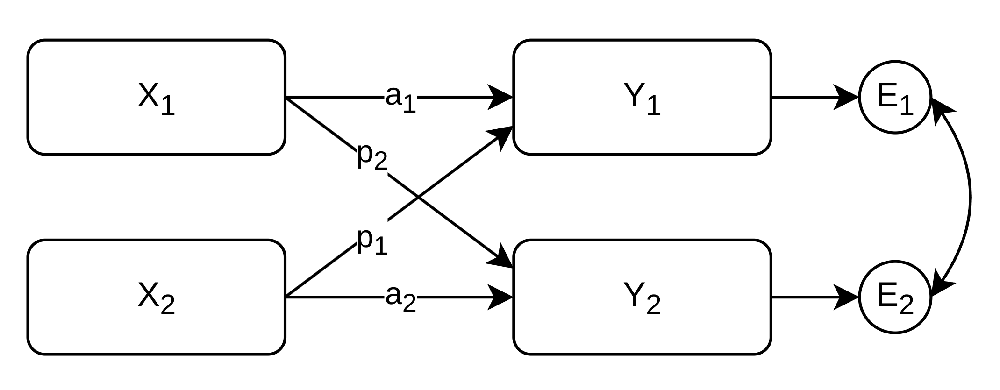
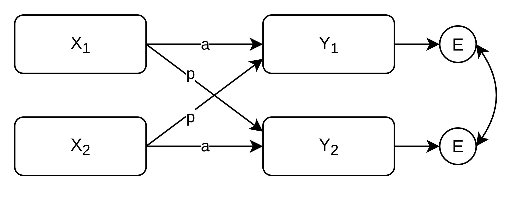
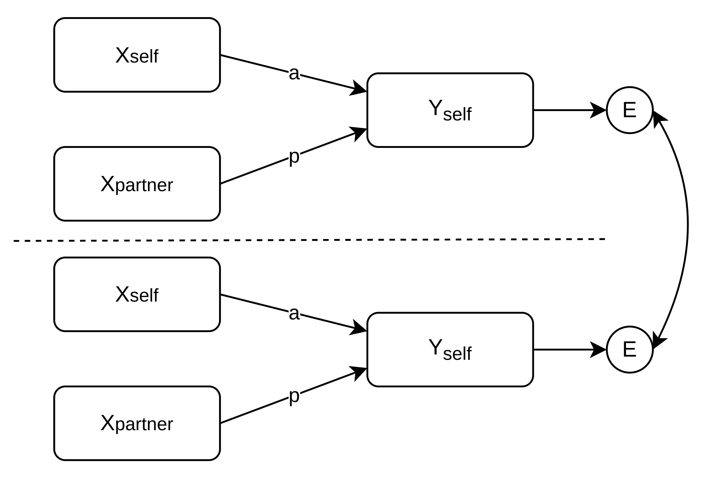

```{r setup, include=FALSE}
knitr::opts_chunk$set(echo = TRUE)
rm(list = ls())
gc()
library(glue)
```

## Overview

* Distinguishable Dyads
  * Cross-Sectional APIM
  * Longitudinal APIM
  
* Exchangeable Dyads
  * Cross-Sectional APIM
  * Cross-Sectional DIM
  * Equivalence between APIM and DIM
  * Longitudinal DIM
  * Longitudinal APIM
  
## Loading Libraries and setting CmdStan Backend

```{r, results='hide', message=FALSE, warning=FALSE}
library(tidyverse)
library(brms)
library(bmlm)
library(easystats)
library(DiagrammeR)
library(DHARMa)
library(MASS)
library(purrr)
source(file.path('00_R_Functions', 'ReportModels.R'))
source(file.path('00_R_Functions', 'PrettyTables.R'))
source(file.path('00_R_Functions', 'PrepareData.R'))

options(
  brms.backend = 'cmdstan',
  brms.file_refit = 'on_change'
)
```


```{r simulating data, echo=FALSE, results='hide'}
# --- Packages (explicit namespacing avoids conflicts) ---
# library(dplyr); library(tidyr); library(tibble); library(MASS)
set.seed(123)

# --- 1. Define Simulation Parameters ---
# Sample Size
n_het <- 550 # Number of heterosexual couples
n_ss  <- 400 # Number of same-sex couples
n_total <- n_het + n_ss

# Residual SDs by gender / dyad type (unchanged)
sd_e_het_female <- 1.1
sd_e_het_male   <- 1.4
sd_e_ss_female  <- 0.9   # (SS individuals coded female in this example)
# sd_e_ss_male <- ...    # if you add male–male couples

# --- NEW: Residual correlations by dyad type (compound symmetry) ---
rho_e_het <- 0.30
rho_e_ss  <- 0.40

# Fixed Effects (the "true" values we want to recover)
gamma_0_het_female <- 5.5
gamma_0_het_male   <- 4.5
gamma_0_ss_person  <- 5.35

gamma_a_het_female <- 1.6
gamma_a_het_male   <- 1.8
gamma_a_ss_person  <- 0.2

gamma_p_het_female <- 0.3
gamma_p_het_male   <- 0.2
gamma_p_ss_person  <- 0.25

# Variance Components
sd_x <- 1.5      # SD of the predictor (communication)
r_x  <- 0.4      # Correlation between partners' communication

# --- UPDATED: smaller, more realistic random slope SDs ---
# (Feel free to tweak; these are modest to reflect heterogeneity without dominating)
sd_u0j <- 0.8    # baseline random intercept SD (unused directly below; see group-specific)
sd_uaj <- 0.15   # (legacy overall; using group-specific below)
sd_upj <- 0.12
cor_u0a <- 0.20
cor_u0p <- 0.15
cor_uap <- -0.10
sd_e    <- 1.2   # legacy scalar residual SD (not used now that we do sex-specific)

# --- 2. Simulate Dyad-Level Variables ---
dyad_data <- tibble::tibble(coupleID = 1:n_total)

# -- 2a: SEPARATE variance components for each group (UPDATED slopes) --

# Heterosexual couples
sd_u0j_het <- 0.8
sd_uaj_het <- 0.15   # was 0.3
sd_upj_het <- 0.12   # was 0.2
cor_u0a_het <- 0.20  # was 0.25
cor_u0p_het <- 0.15  # same
cor_uap_het <- -0.10 # same

# Same-sex couples
sd_u0j_ss <- 1.0
sd_uaj_ss <- 0.12   # was 0.2
sd_upj_ss <- 0.15   # was 0.25
cor_u0a_ss <- 0.10
cor_u0p_ss <- -0.05
cor_uap_ss <- 0.00

# -- 2b: Variance-covariance matrices --
cov_matrix_u_het <- matrix(c(
  sd_u0j_het^2,                      cor_u0a_het*sd_u0j_het*sd_uaj_het, cor_u0p_het*sd_u0j_het*sd_upj_het,
  cor_u0a_het*sd_u0j_het*sd_uaj_het, sd_uaj_het^2,                      cor_uap_het*sd_uaj_het*sd_upj_het,
  cor_u0p_het*sd_u0j_het*sd_upj_het, cor_uap_het*sd_uaj_het*sd_upj_het, sd_upj_het^2
), nrow = 3, byrow = TRUE)

cov_matrix_u_ss <- matrix(c(
  sd_u0j_ss^2,                     cor_u0a_ss*sd_u0j_ss*sd_uaj_ss, cor_u0p_ss*sd_u0j_ss*sd_upj_ss,
  cor_u0a_ss*sd_u0j_ss*sd_uaj_ss,  sd_uaj_ss^2,                   cor_uap_ss*sd_uaj_ss*sd_upj_ss,
  cor_u0p_ss*sd_u0j_ss*sd_upj_ss,  cor_uap_ss*sd_uaj_ss*sd_upj_ss, sd_upj_ss^2
), nrow = 3, byrow = TRUE)

# -- 2c: Generate random effects separately for each group --
random_effects_het <- MASS::mvrnorm(n = n_het, mu = c(0, 0, 0), Sigma = cov_matrix_u_het)
random_effects_ss  <- MASS::mvrnorm(n = n_ss,  mu = c(0, 0, 0), Sigma = cov_matrix_u_ss)

# -- 2d: Combine into one dataframe --
het_df_re <- tibble::tibble(
  coupleID = 1:n_het,
  u_0j = random_effects_het[, 1],
  u_aj = random_effects_het[, 2],
  u_pj = random_effects_het[, 3]
)

ss_df_re <- tibble::tibble(
  coupleID = (n_het + 1):n_total,
  u_0j = random_effects_ss[, 1],
  u_aj = random_effects_ss[, 2],
  u_pj = random_effects_ss[, 3]
)

combined_re <- dplyr::bind_rows(het_df_re, ss_df_re)

# Generate correlated predictor scores for partners (same as before)
cov_matrix_x <- matrix(c(sd_x^2, r_x*sd_x^2, r_x*sd_x^2, sd_x^2), nrow = 2)
partner_scores <- MASS::mvrnorm(n = n_total, mu = c(5, 5), Sigma = cov_matrix_x)

# Join combined RE with main dyad data
dyad_data <- dyad_data %>%
  dplyr::mutate(
    communication_p1 = partner_scores[, 1],
    communication_p2 = partner_scores[, 2]
  ) %>%
  dplyr::left_join(combined_re, by = "coupleID")

# --- 3. Create Person-Level (Long) Dataframe ---
person1 <- dyad_data %>% dplyr::select(coupleID, communication = communication_p1) %>% dplyr::mutate(p_num = 1)
person2 <- dyad_data %>% dplyr::select(coupleID, communication = communication_p2) %>% dplyr::mutate(p_num = 2)

df <- dplyr::bind_rows(person1, person2) %>%
  dplyr::arrange(coupleID, p_num) %>%
  dplyr::mutate(userID = paste0(coupleID, "_", p_num)) %>%
  dplyr::select(userID, coupleID, communication, p_num)

# Assign gender (1 = female, 2 = male)
het_couples <- 1:n_het
ss_couples  <- (n_het + 1):n_total

df <- df %>%
  dplyr::mutate(
    gender = dplyr::case_when(
      coupleID %in% het_couples & p_num == 1 ~ 1,
      coupleID %in% het_couples & p_num == 2 ~ 2,
      coupleID %in% ss_couples               ~ 1
    )
  )

temp_df_for_outcome <- df %>%
  dplyr::group_by(coupleID) %>%
  dplyr::mutate(
    communication_actor   = communication,
    communication_partner = communication[2:1]
  ) %>%
  dplyr::ungroup() %>%
  dplyr::left_join(dyad_data, by = "coupleID") %>%
  dplyr::mutate(
    # Center predictors before generating outcome (grand-mean)
    c_comm_actor   = communication_actor   - mean(communication_actor),
    c_comm_partner = communication_partner - mean(communication_partner),

    # Deterministic part
    satisfaction_deterministic = dplyr::case_when(
      gender == 1 & coupleID <= n_het ~ gamma_0_het_female + gamma_a_het_female * c_comm_actor + gamma_p_het_female * c_comm_partner,
      gender == 2 & coupleID <= n_het ~ gamma_0_het_male   + gamma_a_het_male   * c_comm_actor + gamma_p_het_male   * c_comm_partner,
      gender == 1 & coupleID >  n_het ~ gamma_0_ss_person  + gamma_a_ss_person  * c_comm_actor + gamma_p_ss_person  * c_comm_partner
    )
  )

# --- NEW: Residuals with compound symmetry (per dyad) & sex-specific SDs -------
resid_pairs <- tibble::tibble(coupleID = 1:n_total) %>%
  dplyr::mutate(
    sd1 = ifelse(coupleID <= n_het, sd_e_het_female, sd_e_ss_female),  # p1: het=female, ss=female
    sd2 = ifelse(coupleID <= n_het, sd_e_het_male,   sd_e_ss_female),  # p2: het=male,   ss=female
    rho = ifelse(coupleID <= n_het, rho_e_het,       rho_e_ss)
  ) %>%
  dplyr::rowwise() %>%
  dplyr::mutate(
    e_pair = list(MASS::mvrnorm(
      n = 1, mu = c(0, 0),
      Sigma = matrix(c(sd1^2, rho*sd1*sd2,
                       rho*sd1*sd2, sd2^2), nrow = 2)
    ))
  ) %>%
  dplyr::ungroup() %>%
  tidyr::unnest_wider(e_pair, names_sep = "") %>%
  dplyr::rename(e1 = e_pair1, e2 = e_pair2)

# Attach residuals and finish outcome
temp_df_for_outcome <- temp_df_for_outcome %>%
  dplyr::left_join(resid_pairs, by = "coupleID") %>%
  dplyr::mutate(
    e_i = ifelse(p_num == 1, e1, e2),
    satisfaction = satisfaction_deterministic +
      u_0j + (u_aj * c_comm_actor) + (u_pj * c_comm_partner) + e_i
  ) %>%
  dplyr::select(-e1, -e2)

# Finalize: ORIGINAL OUTPUT FORMAT
df <- temp_df_for_outcome %>%
  dplyr::select(userID, coupleID, gender, communication, satisfaction)

```


# Distinguishable Dyads

## Distinguishable Dyads - Cross-Sectional APIM 

## Distinguishable Dyads - Data: Simulated Dyads

```{r}
print_df(head(df))
```


```{r results='hide', echo=FALSE, message=FALSE}
# subsetting distinguishable dyads
df_filt <- df %>%
  reshape_dyadic_data(
    person_id = 'userID',
    dyad_id = 'coupleID',
    vars_to_reshape = c('communication', 'gender')
  )  

df <- df[df_filt$gender_actor != df_filt$gender_partner, ]

```

## Distinguishable Dyads - Cross-Sectional APIM


[e.g., @kenny2006dyadic; @kennyPartnerEffectsRelationship1999; @kennyDyadicDataAnalysis2011]


## Distinguishable Dyads - Preparing Data

```{r results='hide', message=FALSE, warning=FALSE}
df_apim <- df %>%
  # Reshaping to Actor-Partner format (4-field)
  reshape_dyadic_data(
    person_id = 'userID',
    dyad_id = 'coupleID',
    vars_to_reshape = 'communication'
  )  %>%
  mutate(
    # Optional: grand-mean centering
    communication_actor_gmc = communication_actor - mean(communication_actor),
    communication_partner_gmc = communication_partner - mean(communication_partner),
    
    # Create Dummy-Variables for male and female
    is_female = ifelse(gender == 1, 1, 0),
    is_male = ifelse(gender == 2, 1, 0),
  ) 

print_df(head(df_apim))

```


```{r echo = FALSE, results='hide', message = FALSE, warning= FALSE, error=FALSE}
# Selecting only distinguishable Dyads

df_apim <- relocate(df_apim, 'is_male', 'is_female', .after = 'gender')

```

---

```{r, echo=FALSE}

print_df(head(df_apim))

```


## Distinguishable Dyads - Fitting the Model in BRMS

Model non-indepencence either via a shared random intercept or correlated residuals (not both). 
Posterior predictive checks, residual diagnostics and leave one out cross validation (e.g., via `loo_compare()`) may help inform which one to use.

```{r }
#| code-line-numbers: "1-13|15-26|28-33|35-46"

# Option A: Random-intercept model for non-independence

formula <- bf(
  satisfaction ~ 
    
    # Remove global intercept, introduce male and female intercepts.
    0 + is_male + is_female +
    
    # Actor effect for male and female
    communication_actor_gmc:is_male + 
    communication_actor_gmc:is_female + 
    
    # Partner effect for male and female
    communication_partner_gmc:is_male + 
    communication_partner_gmc:is_female +
    
    # Option 0: Random intercept for male and female (correlated), not identifiable in the cross-sectional case:
    # (0 + is_male + is_female | coupleID)
    
    # Option A: Shared dyad effect - interpretable dyad-level random intercept. 
    (1 | coupleID), 
  
  # Two distinct residual variances for males vs females:
  sigma = ~ 0 + is_male + is_female
)

priors <- c(
  # prior(normal(2, 3), class = "Intercept"),
  prior(normal(0, 5), class = "b"),
  prior(student_t(3, 0, 1.5), class = "b", dpar = "sigma"),
  prior(student_t(3, 0, 2.5), class = "sd")
)

model_dist_apim_a <- brm(
  formula = formula, 
  data = df_apim,
  family = gaussian(link = identity),
  prior = priors,
  chains = 4,
  cores = 4,
  iter = 2000,
  warmup = 1000, 
  seed = 123,
  file = file.path('brms_cache', 'example1_dist_apim_a') # Cache the model
)


```

## Distinguishable Dyads - Fitting the Model in BRMS


```{r }
#| code-line-numbers: "1-13|15-26|28-33|35-46"

# Option B: Residual CS for non-independence (no random intercept)

formula <- bf(
  satisfaction ~ 
    
    # Remove global intercept, introduce male and female intercepts.
    0 + is_male + is_female +
    
    # Actor effect for male and female
    communication_actor_gmc:is_male + 
    communication_actor_gmc:is_female + 
    
    # Partner effect for male and female
    communication_partner_gmc:is_male + 
    communication_partner_gmc:is_female +
  
    # Option B: Model non-independence by using compound symmetry of the residuals. Works and provides interpretable...
    cosy(gr = coupleID),
  
  # Two distinct residual variances for males vs females:
  sigma = ~ 0 + is_male + is_female
)

priors <- c(
  # prior(normal(2, 3), class = "Intercept"),
  prior(normal(0, 5), class = "b"),
  prior(student_t(3, 0, 1.5), class = "b", dpar = "sigma"),
  prior(beta(1, 3), class = "cosy")
)

model_dist_apim_b <- brm(
  formula = formula, 
  data = df_apim,
  family = gaussian(link = identity),
  prior = priors,
  chains = 4,
  cores = 4,
  iter = 2000,
  warmup = 1000, 
  seed = 123,
  file = file.path('brms_cache', 'example1_dist_apim_b') # Cache the model
)


```


## Distinguishable Dyads - Check Model Convergence and Fit

Check Rhats and Effective Sample Sizes (ESS_tail and ESS_bulk) directly from the brms summary. Additionally you can (using Model B as an example):

```{r cache = TRUE, message=TRUE}
rstan::check_hmc_diagnostics(model_dist_apim_b$fit)
loo::pareto_k_table(loo(model_dist_apim_b))
```

--- 

```{r eval=FALSE}
plot(model_dist_apim_b, ask = FALSE)
```

```{r echo=FALSE}
p1 <- plot(model_dist_apim_b, ask=FALSE, nvariables = 3, plot = FALSE)
p1[[2]] # Look at ALL parameters, here only a subset of 3 is printed for slides
```
--- 

```{r cache = TRUE}
pp_check(model_dist_apim_b, 'dens_overlay_grouped', group = 'is_male')
```

---

```{r cache = TRUE}
pp_check(model_dist_apim_b, 'ecdf_overlay_grouped', group = 'is_male')
```

---

```{r cache = TRUE}
pp_check(model_dist_apim_b, type = "loo_pit_overlay")
```

---

```{r cache = TRUE}
# Custom function to make DHARMa work with brms (see file 'Functions')
DHARMa.check_brms(model_dist_apim_b)
```

---

```{r echo = FALSE}

summary_apim <- summarize_brms(
    model_dist_apim_b, 
    stats_to_report = c('CI', 'Rhat', 'ESS')
    )

print_df(
  summary_apim, 
  rows_to_pack = list(
    'Fixed Effects' = c(1,6),
    'Residual Structure' = c(7,9)
    )
  )

```

Note that sigma is reported on the log scale (see ?brmsfamily). Using exp(value) retrieves the simulated values well. 

## Distinguishable Dyads - (Intensive) Longitudinal APIM

## Distinguishable Dyads - L-APIM - Data: Time and Ties

```{r echo = FALSE, results='hide'}

set.seed(123)

# ===============================
# 1) Design
# ===============================
n_couples <- 60
days      <- 0:55
T_per     <- length(days)

# People per couple: p1 = female, p2 = male
persons <- tibble(
  coupleID  = rep(1:n_couples, each = 2),
  p_num     = rep(1:2, times = n_couples),
  gender    = ifelse(p_num == 1, 1, 2),     # 1=female, 2=male
  is_female = as.integer(gender == 1),
  is_male   = as.integer(gender == 2),
  userID    = paste0(coupleID, "_", p_num)
)

# ===============================
# 2) Fixed effects (edit as desired)
# ===============================
b0_female <- 5.5; b0_male <- 4.7
b_time_female <-  0.010; b_time_male <- -0.005

# Between-person APIM (effects of person means)
b_bp_actor_f <- 0.40; b_bp_partner_f <- 0.25
b_bp_actor_m <- 0.35; b_bp_partner_m <- 0.20

# Within-person APIM (effects of daily deviations)
b_wp_actor_f <- 0.30; b_wp_partner_f <- 0.15
b_wp_actor_m <- 0.32; b_wp_partner_m <- 0.12

# ===============================
# 3) Couple-level random effects (full var-cov)
#    Vector: [b0_m, b0_f, time_m, time_f, wpA_m, wpP_m, wpA_f, wpP_f]
# ===============================
sd_re <- c(0.70, 0.80, 0.015, 0.015, 0.10, 0.08, 0.10, 0.08)
R     <- matrix(0.15, 8, 8); diag(R) <- 1
Sigma_re <- diag(sd_re) %*% R %*% diag(sd_re)

RE <- MASS::mvrnorm(n_couples, mu = rep(0, 8), Sigma = Sigma_re) |>
  as_tibble(.name_repair = ~c("re_b0_m","re_b0_f","re_time_m","re_time_f",
                              "re_wpA_m","re_wpP_m","re_wpA_f","re_wpP_f")) |>
  mutate(coupleID = 1:n_couples)

# ===============================
# 4) Provided support (predictor)
#    - Person means are correlated within couple
#    - Daily AR(1) within person; partner innovations correlated same day
# ===============================
mu_sup_f <- 5.0; sd_mu_f <- 0.8
mu_sup_m <- 4.8; sd_mu_m <- 0.8
rho_couple_mean <- 0.50
Sigma_mu <- matrix(c(sd_mu_f^2, rho_couple_mean*sd_mu_f*sd_mu_m,
                     rho_couple_mean*sd_mu_f*sd_mu_m, sd_mu_m^2), 2)

mu_pairs <- MASS::mvrnorm(n_couples, mu = c(mu_sup_f, mu_sup_m), Sigma = Sigma_mu)
mu_df <- tibble(
  coupleID = rep(1:n_couples, each = 2),
  p_num    = rep(1:2, times = n_couples),
  mu_sup   = c(rbind(mu_pairs[,1], mu_pairs[,2]))
)

phi_sup <- 0.50
sd_sup_wp <- 0.9
sd_eta_sup <- sqrt(sd_sup_wp^2 * (1 - phi_sup^2))
rho_sup_day <- 0.35
Sigma_eta_day <- matrix(c(sd_eta_sup^2, rho_sup_day*sd_eta_sup^2,
                          rho_sup_day*sd_eta_sup^2, sd_eta_sup^2), 2)

sim_support_one_couple <- function(cid) {
  eta <- MASS::mvrnorm(T_per, mu = c(0,0), Sigma = Sigma_eta_day)
  sup <- matrix(NA_real_, nrow = T_per, ncol = 2)
  sup[1,] <- eta[1,] / sqrt(1 - phi_sup^2)   # stationary init
  for (t in 2:T_per) sup[t,] <- phi_sup * sup[t-1,] + eta[t,]
  tibble(coupleID = cid, diaryday = days, sup_f = sup[,1], sup_m = sup[,2])
}

support_time <- purrr::map_dfr(1:n_couples, sim_support_one_couple)

support_long <- support_time |>
  pivot_longer(c(sup_f, sup_m), names_to = "who", values_to = "sup_cwp") |>
  mutate(p_num = ifelse(who == "sup_f", 1, 2)) |>
  dplyr::select(-who) |>
  left_join(mu_df, by = c("coupleID","p_num")) |>
  mutate(provided_support = mu_sup + sup_cwp) |>
  dplyr::select(coupleID, diaryday, p_num, provided_support, sup_cwp)

# ===============================
# 5) Assemble panel & partner lookups (safe keys)
# ===============================
panel <- expand_grid(coupleID = 1:n_couples, diaryday = days, p_num = 1:2) |>
  left_join(persons, by = c("coupleID","p_num")) |>
  left_join(support_long, by = c("coupleID","diaryday","p_num"))

# Partner same-day values
panel <- panel |>
  group_by(coupleID, diaryday) |>
  mutate(
    provided_support_partner = provided_support[3 - p_num],
    sup_cwp_partner          = sup_cwp[3 - p_num]
  ) |>
  ungroup()

# Couple means via clean joins
mu_actor_tbl   <- mu_df |> rename(mu_actor = mu_sup)
mu_partner_tbl <- mu_df |> mutate(p_num = 3 - p_num) |> rename(mu_partner = mu_sup)

panel <- panel |>
  left_join(mu_actor_tbl,   by = c("coupleID","p_num")) |>
  left_join(mu_partner_tbl, by = c("coupleID","p_num"))

# ===============================
# 6) Same-day couple×day random effect (common shocks)
# ===============================
use_day_RE <- TRUE     # set FALSE if you don't want (1 | coupleID:diaryday)
sd_day <- 0.40
if (use_day_RE) {
  day_shock <- expand_grid(coupleID = 1:n_couples, diaryday = days) |>
    mutate(z_day = rnorm(n(), 0, sd_day))
  panel <- panel |> left_join(day_shock, by = c("coupleID","diaryday"))
} else {
  panel <- panel |> mutate(z_day = 0)
}

# ===============================
# 7) Deterministic mean of daily closeness
# ===============================
grand_mu <- mean(mu_df$mu_sup)  # ONE global grand mean for CBP

panel <- panel |>
  left_join(RE, by = "coupleID") |>
  mutate(
    # fixed parts by gender
    fix_b0   = ifelse(is_male==1, b0_male, b0_female),
    fix_time = ifelse(is_male==1, b_time_male, b_time_female),
    fix_bp_actor   = ifelse(is_male==1, b_bp_actor_m,  b_bp_actor_f),
    fix_bp_partner = ifelse(is_male==1, b_bp_partner_m,b_bp_partner_f),
    fix_wp_actor   = ifelse(is_male==1, b_wp_actor_m,  b_wp_actor_f),
    fix_wp_partner = ifelse(is_male==1, b_wp_partner_m,b_wp_partner_f),

    # couple-level REs by gender
    re_b0      = ifelse(is_male==1, re_b0_m,   re_b0_f),
    re_time    = ifelse(is_male==1, re_time_m, re_time_f),
    re_wp_actor= ifelse(is_male==1, re_wpA_m,  re_wpA_f),
    re_wp_part = ifelse(is_male==1, re_wpP_m,  re_wpP_f),

    # latent components
    actor_cwp   = sup_cwp,
    partner_cwp = sup_cwp_partner,
    actor_cbp   = mu_actor   - grand_mu,
    partner_cbp = mu_partner - grand_mu,

    # deterministic mean
    mu_it =
      fix_b0 + fix_time * diaryday +
      fix_bp_actor   * actor_cbp   + fix_bp_partner * partner_cbp +
      fix_wp_actor   * actor_cwp   + fix_wp_partner * partner_cwp +
      re_b0 + re_time * diaryday +
      re_wp_actor * actor_cwp + re_wp_part * partner_cwp +
      z_day
  )

# ===============================
# 8) Residuals: AR(1) within person, gender-specific σ
# ===============================
phi_eps <- 0.55
sd_eps_f <- 0.90; sd_eps_m <- 1.10
sd_eta_f <- sqrt(sd_eps_f^2 * (1 - phi_eps^2))
sd_eta_m <- sqrt(sd_eps_m^2 * (1 - phi_eps^2))

simulate_ar1_resid <- function(n, sd_eta, phi=phi_eps) {
  e <- numeric(n)
  e[1] <- rnorm(1, 0, sd = sd_eta / sqrt(1 - phi^2))
  if (n >= 2) for (t in 2:n) e[t] <- phi * e[t-1] + rnorm(1, 0, sd_eta)
  e
}

# Vectorized generation (fast)
idx <- panel |>
  arrange(userID, diaryday) |>
  distinct(userID, is_male)
eps_list <- mapply(
  FUN = simulate_ar1_resid,
  n = T_per,
  sd_eta = ifelse(idx$is_male==1, sd_eta_m, sd_eta_f),
  SIMPLIFY = FALSE
)
eps_vec <- unlist(eps_list, use.names = FALSE)

panel <- panel |>
  arrange(userID, diaryday) |>
  mutate(e_it = eps_vec) |>
  arrange(coupleID, diaryday, p_num)

# ===============================
# 9) Outcomes & exports
# ===============================
df_long <- panel |>
  mutate(daily_closeness = mu_it + e_it) |>
  dplyr::select(userID, coupleID, diaryday, gender,
         daily_closeness, provided_support) |>
  arrange(coupleID, userID, diaryday)

# MODEL-READY (with centered time + CBP/CWP for APIM)
df_long_apim <- df_long |>
  left_join(persons |> dplyr::select(userID, coupleID, is_male, is_female), by = c("userID","coupleID")) |>
  # Re-attach partner series for isolation
  left_join(panel |>
              dplyr::select(userID, coupleID, diaryday,
                     provided_support_actor = provided_support,
                     provided_support_partner = provided_support_partner),
            by = c("userID","coupleID","diaryday")) |>
  # Proper APIM centering (within person)
  group_by(userID) |>
  mutate(
    provided_support_actor_cbp   = mean(provided_support_actor, na.rm = TRUE),
    provided_support_actor_cwp   = provided_support_actor - provided_support_actor_cbp,
    provided_support_partner_cbp = mean(provided_support_partner, na.rm = TRUE),
    provided_support_partner_cwp = provided_support_partner - provided_support_partner_cbp
  ) |>
  ungroup() |>
  # Center time (global)
  mutate(diaryday_c = diaryday - mean(diaryday)) |>
  arrange(coupleID, userID, diaryday)

# Quick integrity checks (optional)
stopifnot(nrow(df_long) == n_couples * 2 * T_per)
stopifnot(!any(is.na(df_long$daily_closeness)))
stopifnot(!any(is.na(df_long$provided_support)))


```


```{r echo = FALSE, results='hide', warning=FALSE, message=FALSE}

df_long_apim <- df_long %>%
  mutate(
  is_female = ifelse(gender == 1, 1, 0), 
  is_male = ifelse(gender == 2, 1, 0)
  ) %>% 
  reshape_dyadic_data(
    person_id = 'userID',
    dyad_id = 'coupleID',
    time = 'diaryday',
    vars_to_reshape = c('provided_support')
  )


```


```{r echo = FALSE, results='hide', warning=FALSE, message=FALSE}

# Function for previev (not needed for analysis!)
print_couple_preview <- function(df, couple_id,
                                 days = 0:2) {
  # Filter/sort/select with original types
  dfc0 <- df %>%
    dplyr::filter(coupleID == couple_id) %>%
    dplyr::arrange(userID, diaryday)

  # Identify partners
  partners <- dfc0 %>%
    dplyr::distinct(userID) %>%
    dplyr::arrange(userID) %>%
    dplyr::pull(userID)

  if (length(partners) < 2)
    stop("This couple doesn't have two partners in the data.")

  # Slice by partner & day BEFORE coercion
  p1 <- dfc0 %>% dplyr::filter(userID == partners[1], diaryday %in% days)
  p2 <- dfc0 %>% dplyr::filter(userID == partners[2], diaryday %in% days)

  # Coerce everything to character explicitly (belt-and-suspenders on coupleID)
  to_chr <- function(x) x %>%
    dplyr::mutate(
      dplyr::across(where(is.numeric), ~round(., 2)), 
      dplyr::across(dplyr::everything(), as.character),
      coupleID = as.character(coupleID)
      )

  p1c <- to_chr(p1)
  p2c <- to_chr(p2)

  # 1-row "..." tibble with same columns (all character)
  colset <- names(dfc0)
  ellipsis_row <- tibble::as_tibble(setNames(rep(list("..."), length(colset)), colset))

  dplyr::bind_rows(p1c, ellipsis_row, p2c)
}


```


```{r echo=FALSE}

print_df(print_couple_preview(df_long_apim[, c(1,2,3,4,5,7,8,9,10)], couple_id = "31"))  

```


## Distinguishable Dyads - L-APIM - Centering 

With repeated measures we need to center variables in order to not conflate levels of analysis:

* Between-Person: The person-mean in relation to the grand mean
* Within-Person: Daily fluctuations of an individual from their person-mean

While it may seem like we have 3-levels (couple/person/day), by including the means of both partners and their correlations in the model, all information about the couple-level (level 3) is included. This will become clear when comparing the exchangeable APIM to the DIM. We thus use a 2-level model with the dyad as the level of analysis. 


## Distinguishable Dyads - L-APIM - Centering 

```{r}
df_long_apim <- bmlm::isolate(
  df_long_apim, 
  by = 'userID', # NOT coupleID
  value = c('provided_support_actor', 'provided_support_partner'),
  which = 'both' 
) %>%
  rename(
    provided_support_actor_cwp = provided_support_actor_cw,
    provided_support_partner_cwp = provided_support_partner_cw,
    provided_support_actor_cbp = provided_support_actor_cb,
    provided_support_partner_cbp = provided_support_partner_cb,
  ) %>%
  # Centering time
  mutate(
    diaryday_c = scale(diaryday, center = TRUE, scale = FALSE)
  )

```


## Distinguishable Dyads - L-APIM - Model 


```{r}

formula <- bf(
  daily_closeness ~ 
    
    # Intercepts
    0 + is_male + is_female +
    
    # Time Slopes
    is_male:diaryday_c +
    is_female:diaryday_c +
    
    # Between-Person APIM
    is_male:provided_support_actor_cbp + 
    is_male:provided_support_partner_cbp +
    
    is_female:provided_support_actor_cbp + 
    is_female:provided_support_partner_cbp +
  
    # Within-Person APIM
    is_male:provided_support_actor_cwp + 
    is_male:provided_support_partner_cwp +
    
    is_female:provided_support_actor_cwp + 
    is_female:provided_support_partner_cwp +
    
    # Accounting for non-independence between partners' means and trajectories 
    # and effect sensitivities via random effects:
    (0 + is_male + is_female +  
       
       is_male:diaryday_c + is_female:diaryday_c + 
       
       is_male:provided_support_actor_cwp + 
       is_male:provided_support_partner_cwp +
       is_female:provided_support_actor_cwp + 
       is_female:provided_support_partner_cwp | coupleID ) + 
    
    
    # Accounting for daily non-independence
    
    # Option 1: model correlated residuals on the day with a 
    # compound symmetry structure:
    # cosy(time = diaryday, gr = coupleID),
    
    # Option 2: model daily coupling / common shocks with a random effect:
    # Note that this introduces a large number of parameters and may not converge!
    (1 | coupleID:diaryday) +
    
    
    # Modelling residuals as autocorrelated within each person (order 1)
    # Note that in brms this is only possible if cosy() is not used. 
    # If Option 2 can not be used instead of cosy, consider using cosy and dropping ar1. 
    # You may use loo_compare() to get the best converging fit. 
    ar(time = diaryday, gr = coupleID:userID, p = 1),
    
  sigma ~ 0 + is_male + is_female   # heteroscedastic residuals
)

priors <- c(
  prior(normal(0, 5), class = "b"),
  prior(student_t(3, 0, 1.5), class = "sd"),
  prior(normal(0.5, 0.3), class = "ar"),
  prior(student_t(3, 0, 1.5), class ="b", dpar = "sigma")
)


model_dist_apim_long <- brm(
  formula = formula, 
  data = df_long_apim,
  family = gaussian(link = identity),
  prior = priors,
  chains = 4,
  cores = 4,
  iter = 2000,
  warmup = 1000, 
  seed = 123,
  file = file.path('brms_cache', 'example1_dist_apim_long') # Cache the model
)

```


## Distinguishable Dyads - L-APIM - Results (scrollable) 

```{r echo=FALSE}

summary_apim <- summarize_brms(
    model_dist_apim_long, 
    stats_to_report = c('CI', 'Rhat', 'ESS')
    )

print_df(
  summary_apim, 
  rows_to_pack = list(
    'Fixed Effects' = c(1,12),
    'Random Effects' = c(13,49),
    'Residual Structure' = c(50,52)
    )
  )

```


# Exchangeable Dyads


## Exchangeable Dyads - Cross-Sectional APIM

```{r, echo=FALSE, fig.width=8, fig.align='center', include = FALSE}

DiagrammeR::grViz(glue("
  digraph APIM {{
    graph [
      size='11,11!'
      layout=dot 
      rankdir='LR' 
      label='APIM' 
      labelloc=t
    ]
    
    node [
      shape=box 
      fixedsize=true 
      width=1
      fontsize = 10
    ]
    pre1 [label='Communication \n A']
    out1 [label='Satisfaction \n A']
    pre2 [label='Communication \n B']
    out2 [label='Satisfaction \n B']
    
    edge [
      minlen=2.5
      labelfloat=true 
      fontsize=12
    ]
    pre1 -> out1 [label='a']
    pre2 -> out1 [taillabel='p' labeldistance=4 labelangle=-15 constraint=false]
    pre1 -> out2 [taillabel='p' labeldistance=4 labelangle=15 constraint=false]
    pre2 -> out2 [label='a']
  }}
"))


```


[e.g., @delrosarioPracticalGuideSpecifying2025; @kenny_ackerman_2023]

## Exchangeable Dyads - Cross-Sectional APIM


[e.g., @delrosarioPracticalGuideSpecifying2025; @kenny_ackerman_2023]

```{r, echo=FALSE, fig.width=7, fig.align='center', include = FALSE}

DiagrammeR::grViz(glue("
  digraph APIM {{
    graph [
      size='11,11!'
      layout=dot 
      rankdir='LR' 
      label='APIM' 
      labelloc=t
    ]
    
    node [
      shape=box 
      fixedsize=true 
      width=1
      fontsize = 10
    ]
    pre1 [label='Communication \n Self']
    out1 [label='Satisfaction \n Self']
    pre2 [label='Communication \n Partner']

    edge [
      minlen=2.5
      labelfloat=true 
      fontsize=12
    ]
    pre1 -> out1 [label='a']
    pre2 -> out1 [taillabel='p' labeldistance=3.8 labelangle=-8 constraint=false]
  }}
"))


```

--- 

## Exchangeable Dyads - Main Assumptions

Partners are exchangeable, i.e., not *systematically* different.

* Equal actor effects 
* Equal partner effects
* Equal means 
* Equal residual variances

But they should still be allowed to vary within each couple, while being correlated.

[e.g., @delrosarioPracticalGuideSpecifying2025; @kenny_ackerman_2023]

## Exchangeable Dyads - Cross-Sectional APIM: Data

Same cross-sectional data in the same 4-field actor-partner format as before. 
```{r}

print_df(head(df_apim))

```


## Exchangeable Dyads - Cross-Sectional APIM: Model


```{r }
#| code-line-numbers: "1-14|16-34"

formula <- bf(
  satisfaction ~ 1 + 
    communication_actor_gmc + communication_partner_gmc + 
    
    # Option 1: A single couple level random intercept. Too restrictive.
    # Would impose perfect correlation between partners in each couple
    # (1 | coupleID)
    
    cosy(gr = coupleID)
  
  # Note: no need to model separate sigmas for each partner.
  # Homogeneous residual variance is estimated: 
  # Implied: sigma = ~ 1
)

priors <- c(
  prior(normal(2, 10), class = "Intercept"),
  prior(normal(0, 5), class = "b"),
  prior(student_t(3, 0, 1.5), class = "sigma"),
  prior(beta(1, 3), class = "cosy")
)

model_ind_apim <- brm(
  formula = formula, 
  data = df_apim,
  family = gaussian(link = identity),
  prior = priors,
  chains = 4,
  cores = 4,
  iter = 2000,
  warmup = 1000, 
  seed = 123,
  file = file.path('brms_cache', 'example1_ind_apim') # Cache the model
)

```


## Exchangeable Dyads - Cross-Sectional APIM: Results

```{r, echo=FALSE}

summary_apim <- summarize_brms(
    model_ind_apim, 
    stats_to_report = c('CI', 'Rhat', 'ESS')
    )

print_df(
  summary_apim, 
  rows_to_pack = list(
    'Fixed Effects' = c(1,3),
    'Residual Structure' = c(4,5)
    )
  )

```


## Exchangeable Dyads - Cross-Sectional APIM: Test for Distinguishability

Leave-one-out (loo) cross-validation for model comparison (even if not nested).

```{r eval=FALSE}
a <- loo_compare(
  loo(model_ind_apim), 
  loo(model_dist_apim)
)
print(a)
```

| Model             | elpd_diff | se_diff | 
|-------------------|-----------|---------|
| model_dist_apim   | 0.0       | 0.0     | 
| model_ind_apim    | -98.7     | 13.0    | 


```{r eval = FALSE}
report::report(a)
```

<p style="font-size:80%; line-height:1.35">
The difference in predictive accuracy, as indexed by Expected Log Predictive 
Density (ELPD-LOO), suggests that 'model_dist_apim' is the best model (ELPD = -1965.61), 
followed by 'model_ind_apim' (diff-ELPD = -98.72 ± 13.00, p &lt; .001).<br>
See: <a href="https://easystats.github.io/report/reference/report.compare.loo.html">documentation of "report"</a>
</p>

## Exchangeable Dyads - Cross-Sectional DIM

```{r, echo=FALSE}

DiagrammeR::grViz(glue("
  digraph DIM {{
    graph [
      size='11,11!'
      layout=dot
      rankdir='LR'
      label='Dyad–Individual Model (DIM)'
      labelloc=t
    ]

    node [
      shape=box
      fixedsize=true
      width=1.4
      fontsize=10
    ]
    pre1 [label='Communication\\nBetween-couple (cbc)']
    out1 [label='Satisfaction\\n(Self)']
    pre2 [label='Communication\\nWithin-couple (cwc)']

    edge [
      minlen=2.5
      labelfloat=true
      fontsize=12
    ]
    pre1 -> out1 [label='between']
    pre2 -> out1 [taillabel='within' labeldistance=4 labelangle=-15 constraint=false]
  }}
"))


```

---

## Exchangeable Dyads - Cross-Sectional DIM: Data

Starting from scratch (no 4-field data needed)

```{r echo = FALSE}

df_apim2 <- df_apim[, c('userID', 'coupleID', 'communication', 'satisfaction')]

print_df(head(df_apim2))

```

## Exchangeable Dyads - Cross-Sectional DIM: Centering

Decompose `communication` variance into:

* **Between-couple** (cbc): Couple-mean communication skills in relation to other couples
* **Within-couple** (cwc): Individuals’ communication skills in relation to their couple-mean

Same assumption about exchangeability as in the APIM

## Exchangeable Dyads - Cross-Sectional DIM: Centering


```{r}
df_dim <- df_apim2 %>%
  group_by(coupleID) %>%
  mutate(
    communication_cm = mean(communication, na.rm = TRUE),
    communication_cwc= communication - communication_cm
  ) %>%
  ungroup() %>%
  mutate(
    communication_cbc= communication_cm - mean(communication_cm, na.rm = TRUE)
  ) %>% 
  dplyr::select(c('userID', 'coupleID', 'satisfaction', 'communication_cwc', 'communication_cbc'))

print_df(head(df_dim))
```


## Exchangeable Dyads - Cross-Sectional DIM: Model

```{r}
#| code-line-numbers: "1-5|7-11|12-24"

formula <- bf(
  satisfaction ~ 1 + 
    communication_cbc+ communication_cwc + 
    cosy(gr = coupleID) 
)

priors <- c(
  prior(normal(2, 10), class = "Intercept"),
  prior(normal(0, 5), class = "b"),
  prior(student_t(3, 0, 1.5), class = "sigma"),
  prior(beta(1, 3), class = "cosy")
)

model_ind_dim <- brm(
  formula = formula, 
  data = df_dim,
  family = gaussian(link = identity),
  prior = priors,
  chains = 4,
  cores = 4,
  iter = 2000,
  warmup = 1000, 
  seed = 123,
  file = file.path('brms_cache', 'example1_ind_dim') # Cache the model
)

```


## Exchangeable Dyads - Cross-Sectional DIM: Results

```{r, echo=FALSE}

summary_dim <- summarize_brms(
    model_ind_dim, 
    stats_to_report = c('CI', 'Rhat', 'ESS')
    )

print_df(
  summary_dim, 
  rows_to_pack = list(
    'Fixed Effects' = c(1,3),
    'Residual Structure' = c(4,5)
    )
  )
```


## Equivalence APIM and DIM


$$b_{actor\_gmc} + b_{partner\_gmc} = b_{cbc}$$
$$b_{actor\_gmc} - b_{partner\_gmc} = b_{cwc}$$ 

[@Bolger2025Unified]


## Equivalence APIM and DIM


```{=html}


<section data-background-color="#ffffff">
  <p style="margin-top:0;font-size:1.2rem;max-width:1100px;">
    Top sliders: grand-mean-centered <em>Communication</em> for <strong>Actor</strong> and <strong>Partner</strong> (APIM).<br>
    Bottom sliders: reparameterized communication — <strong>Centered Between-Couple</strong> (<code>x<sub>cbc</sub></code>) and <strong>Centered Within-Couple</strong> (<code>x<sub>cwc</sub></code>) (DIM).<br>
  </p>

  <style>
    .slider-grid{
      display:grid;
      grid-template-columns:250px 1fr 80px auto;
      gap:14px;
      align-items:center;
      font-size:1.2rem;
      margin-bottom:1.2rem;
      width:100%;
    }
    .slider-grid>label{grid-column:1;font-weight:600}
    .slider-grid>input[type="range"]{grid-column:2;width:100%;accent-color:steelblue;height:10px;cursor:pointer}
    .slider-grid>input[data-group="lower"]{accent-color:coral}
    .slider-grid>output{grid-column:3;font-variant-numeric:tabular-nums;text-align:right;width:3.8ch;font-size:1.15rem}
    .reset-cell{grid-column:4;grid-row:1/-1;align-self:center;justify-self:start}
    #reset-btn{background:#4B5563;color:#FAFAFA;border:none;padding:.6rem 1.2rem;border-radius:8px;font-size:1.05rem;cursor:pointer;transition:background .2s}
    #reset-btn:hover{background:#1F2937}

    .equations{margin-top:1.1rem}
    .math{
      font-family:'STIX Two Text','Times New Roman',serif;
      font-size:1.30rem;
      line-height:1.6;
      font-variant-numeric:lining-nums tabular-nums;
      letter-spacing:.05px;
    }
    .eq-table{
      display:grid;
      grid-template-columns:
        1.5ch auto 1.4ch minmax(7.8ch,max-content) 1.4ch minmax(19ch,max-content)
        1.4ch minmax(19ch,max-content) 1.4ch minmax(8.6ch,max-content);
      column-gap:.7rem; row-gap:.45rem; align-items:baseline; justify-content:start; width:100%;
    }
    .cell.label{font-weight:750;color:#334155;font-size:1.32rem}
    .cell.op{opacity:.9;text-align:center}

    .num{display:inline-flex;align-items:baseline}
    .sign{display:inline-block;width:1.1ch;text-align:right;padding-right:.18ch}
    .minus{visibility:visible}.phantom{visibility:hidden}
    .digits{display:inline-block;min-width:5.6ch;text-align:left}
    .times{padding:0 .24rem;font-weight:700;font-size:1.10em}

    .stack{display:inline-flex;flex-direction:column;align-items:center;gap:.08rem}
    .vlabel{font-size:.82rem;line-height:1;letter-spacing:.2px}

    .apx .digits,.apx .sign{color:steelblue}
    .dimx .digits,.dimx .sign{color:coral}
    .apx .vlabel{color:steelblue;font-weight:650}
    .dimx .vlabel{color:coral;font-weight:650}
    .coefwrap .vlabel{color:#6B7280;font-weight:500}
    .result .digits,.result .sign{color:#0f172a;font-weight:800}
  </style>

  <div class="slider-grid">
    <!-- Compact symbolic labels -->
    <label style="color:steelblue;">x<sub>actor_gmc</sub></label>
    <input id="slider-actor" type="range" min="-5" max="5" step="0.1"
      value="0"
      data-group="upper">
    <output id="out-actor">0.00</output>

    <label style="color:steelblue;">x<sub>partner_gmc</sub></label>
    <input id="slider-partner" type="range" min="-5" max="5" step="0.1"
      value="0"
      data-group="upper">
    <output id="out-partner">0.00</output>

    <label style="color:#E26A5C;">x<sub>cbc</sub></label>
    <input id="slider-mean" type="range" min="-5" max="5" step="0.1" value="0" data-group="lower">
    <output id="out-mean">0.00</output>

    <label style="color:#E26A5C;">x<sub>cwc</sub></label>
    <input id="slider-within" type="range" min="-5" max="5" step="0.1" value="0" data-group="lower">
    <output id="out-within">0.00</output>

    <div class="reset-cell"><button id="reset-btn">Reset to 0</button></div>
  </div>

  <!-- Model coefficients -->
  <div id="model-coefs"
       data-apim-b0="`r round(fixef(model_ind_apim)['Intercept','Estimate'], 2)`"
       data-apim-ba="`r round(fixef(model_ind_apim)['communication_actor_gmc','Estimate'], 2)`"
       data-apim-bp="`r round(fixef(model_ind_apim)['communication_partner_gmc','Estimate'], 2)`"
       data-dim-b0 ="`r round(fixef(model_ind_dim)['Intercept','Estimate'], 2)`"
       data-dim-cb ="`r round(fixef(model_ind_dim)['communication_cbc','Estimate'], 2)`"
       data-dim-cw ="`r round(fixef(model_ind_dim)['communication_cwc','Estimate'], 2)`"></div>

  <div class="equations">
    <div id="eq-table" class="eq-table math"></div>
  </div>

  <script>
(function(){
  const MIN=-5, MAX=5;
  const clamp=(x,lo,hi)=>Math.min(hi,Math.max(lo,x));
  const r1 = x => Math.round(x*10)/10;
  const r2 = x => { const y=Math.round(Number(x)*100)/100; return Math.abs(y)<1e-12?0:y; };

  // Elements
  const actor   = document.getElementById('slider-actor');   // x_actor_gmc
  const partner = document.getElementById('slider-partner'); // x_partner_gmc
  const mean    = document.getElementById('slider-mean');    // x_cbc
  const within  = document.getElementById('slider-within');  // x_cwc

  const outA = document.getElementById('out-actor');
  const outP = document.getElementById('out-partner');
  const outM = document.getElementById('out-mean');
  const outW = document.getElementById('out-within');

  const TIMES='×', MINUS='−';
  const coefEl=document.getElementById('model-coefs').dataset;
  const C = {
    apim:{ b0:+coefEl.apimB0, b_actor_gmc:+coefEl.apimBa, b_partner_gmc:+coefEl.apimBp },
    dim: { b0:+coefEl.dimB0,  b_cbc:+coefEl.dimCb,        b_cwc:+coefEl.dimCw }
  };

  const table=document.getElementById('eq-table');

  function SignedNumHTML(v, extra=''){
    const y=r2(v), neg=y<0, abs=Math.abs(y).toFixed(2);
    return `<span class="num ${extra}"><span class="sign ${neg?'minus':'phantom'}">${MINUS}</span><span class="digits">${abs}</span></span>`;
  }
  function VarNumber(label, value, colorClass){
    return `<span class="stack ${colorClass}"><span>${SignedNumHTML(value)}</span><span class="vlabel">${label}</span></span>`;
  }
  function CoefNumber(label, value){
    return `<span class="stack coefwrap"><span>${SignedNumHTML(value,'coef')}</span><span class="vlabel">${label}</span></span>`;
  }
  function row({modelLabel,b0Label,b0,b1Label,b1,x1Label,x1Val,x1Class,b2Label,b2,x2Label,x2Val,x2Class,yVal}){
    return `
      <div></div>
      <div class="cell label">${modelLabel}:&nbsp;Y</div>
      <div class="cell op">=</div>
      <div class="cell">${CoefNumber(b0Label,b0)}</div>
      <div class="cell op">+</div>
      <div class="cell">${CoefNumber(b1Label,b1)}<span class="times">${TIMES}</span>${VarNumber(x1Label,x1Val,x1Class)}</div>
      <div class="cell op">+</div>
      <div class="cell">${CoefNumber(b2Label,b2)}<span class="times">${TIMES}</span>${VarNumber(x2Label,x2Val,x2Class)}</div>
      <div class="cell op">=</div>
      <div class="cell result">${SignedNumHTML(yVal,'result')}</div>`;
  }

  function render(){
    const A=+actor.value, P=+partner.value, M=+mean.value, W=+within.value;
    const yAPIM = C.apim.b0 + C.apim.b_actor_gmc*A + C.apim.b_partner_gmc*P;
    const yDIM  = C.dim.b0  + C.dim.b_cbc*M        + C.dim.b_cwc*W;
    table.innerHTML =
      row({modelLabel:'APIM',
        b0Label:'b<sub>0</sub>', b0:C.apim.b0,
        b1Label:'b<sub>actor_gmc</sub>', b1:C.apim.b_actor_gmc,
        x1Label:'x<sub>actor_gmc</sub>', x1Val:A, x1Class:'apx',
        b2Label:'b<sub>partner_gmc</sub>', b2:C.apim.b_partner_gmc,
        x2Label:'x<sub>partner_gmc</sub>', x2Val:P, x2Class:'apx',
        yVal:yAPIM
      }) +
      row({modelLabel:'DIM',
        b0Label:'b<sub>0</sub>', b0:C.dim.b0,
        b1Label:'b<sub>cbc</sub>', b1:C.dim.b_cbc,
        x1Label:'x<sub>cbc</sub>', x1Val:M, x1Class:'dimx',
        b2Label:'b<sub>cwc</sub>', b2:C.dim.b_cwc,
        x2Label:'x<sub>cwc</sub>', x2Val:W, x2Class:'dimx',
        yVal:yDIM
      });
  }

  function updateOutputs(){
    outA.value=(+actor.value).toFixed(2);
    outP.value=(+partner.value).toFixed(2);
    outM.value=(+mean.value).toFixed(2);
    outW.value=(+within.value).toFixed(2);
  }

  /* =======================
     Feasible-interval helpers
     ======================= */
  // For moving A with P fixed:
  function feasibleA(p){
    // m=(a+p)/2 in [MIN,MAX]  -> a in [2*MIN - p, 2*MAX - p]
    // w=(a-p)/2 in [MIN,MAX]  -> a in [2*MIN + p, 2*MAX + p]
    const lo = Math.max(MIN, 2*MIN - p, 2*MIN + p);
    const hi = Math.min(MAX, 2*MAX - p, 2*MAX + p);
    return [lo, hi];
  }
  // For moving P with A fixed:
  function feasibleP(a){
    const lo = Math.max(MIN, 2*MIN - a, -2*MAX + a); // from w=(a-p)/2 -> p in [a-2*MAX, a-2*MIN]
    const hi = Math.min(MAX, 2*MAX - a, -2*MIN + a);
    // cleaner symmetrical form:
    return [Math.max(MIN, 2*MIN - a, a - 2*MAX),
            Math.min(MAX, 2*MAX - a, a - 2*MIN)];
  }
  // For moving M with W fixed:
  function feasibleM(w){
    // a=m+w ∈ [MIN,MAX] -> m ∈ [MIN - w, MAX - w]
    // p=m-w ∈ [MIN,MAX] -> m ∈ [MIN + w, MAX + w]
    const lo = Math.max(MIN, MIN - w, MIN + w);
    const hi = Math.min(MAX, MAX - w, MAX + w);
    return [lo, hi];
  }
  // For moving W with M fixed:
  function feasibleW(m){
    // a=m+w ∈ [MIN,MAX] -> w ∈ [MIN - m, MAX - m]
    // p=m-w ∈ [MIN,MAX] -> w ∈ [m - MAX, m - MIN]
    const lo = Math.max(MIN, MIN - m, m - MAX);
    const hi = Math.min(MAX, MAX - m, m - MIN);
    return [lo, hi];
  }

  /* =======================
     Move handlers (clamp the moved slider FIRST)
     ======================= */
  function moveActor(){
    const p = r1(+partner.value);
    const [lo,hi] = feasibleA(p);
    const a = r1(clamp(+actor.value, lo, hi)); // hard-stop the thumb
    actor.value = a;
    const m = r1((a + p)/2), w = r1((a - p)/2);
    mean.value = m; within.value = w;
    updateOutputs(); render();
  }
  function movePartner(){
    const a = r1(+actor.value);
    const [lo,hi] = feasibleP(a);
    const p = r1(clamp(+partner.value, lo, hi));
    partner.value = p;
    const m = r1((a + p)/2), w = r1((a - p)/2);
    mean.value = m; within.value = w;
    updateOutputs(); render();
  }
  function moveMean(){
    const w = r1(+within.value);
    const [lo,hi] = feasibleM(w);
    const m = r1(clamp(+mean.value, lo, hi));
    mean.value = m;
    const a = r1(m + w), p = r1(m - w);
    actor.value = a; partner.value = p;
    updateOutputs(); render();
  }
  function moveWithin(){
    const m = r1(+mean.value);
    const [lo,hi] = feasibleW(m);
    const w = r1(clamp(+within.value, lo, hi));
    within.value = w;
    const a = r1(m + w), p = r1(m - w);
    actor.value = a; partner.value = p;
    updateOutputs(); render();
  }

  // Listeners
  actor  .addEventListener('input', moveActor);
  partner.addEventListener('input', movePartner);
  mean   .addEventListener('input', moveMean);
  within .addEventListener('input', moveWithin);

  document.getElementById('reset-btn').addEventListener('click', ()=>{
    actor.value=partner.value=mean.value=within.value=0;
    updateOutputs(); render();
  });

  updateOutputs(); render();
})();
</script>


</section>


```


## Equivalence APIM and DIM

* If the couple mean goes up by 1 and the within-couple deviation from the couple 
mean stays fixed, this means that both partners' predictors must go up by 1 unit. 
Thus, the effects are linear combinations: 

$$b_{cbc} = b_{actor\_gmc} + b_{partner\_gmc}$$

* Similarly, if a person's deviation from their couple mean is one unit higher and
the couple mean stays fixed, this means their partners' deviation must be one unit lower. 
Thus, the effects are a linear combination: 

$$b_{cwc} = b_{actor\_gmc} - b_{partner\_gmc}$$

## Equivalence APIM and DIM

* Conversely, to obtain the actor and partner effects given the DIM estimates: 

$$b_{actor\_gmc} = \frac{b_{cbc} + b_{cwc}}{2}$$

$$b_{partner\_gmc} = \frac{b_{cbc} - b_{cwc}}{2}$$

## Equivalence APIM and DIM

Example: using APIM coefficients to obtain DIM coefficients and computing *Credible Intervals* of DIM coefficients. 

```{r}
a <- hypothesis(
  model_ind_apim, 
  "communication_actor_gmc + communication_partner_gmc = 0"
)

a$hypothesis[,c(2,3,4,5)]
```


## Equivalence APIM and DIM: Takeaway

* **APIM** and **DIM** are reparametrizations of the same model
* **APIM**: intuitive actor/partner framing
* **DIM**: clean separation of between vs within components
* Estimating one model allows for directly obtaining estimates of the other
* Same random-effects structure at dyad level and same assumptions

### Side Note:

In the **distinguishable** case, the **Dyadic Score Model (DSM)** [e.g., @stadlerHowCompanionshipRelated2023] is equivalent to the APIM! [@Bolger2025Unified; @iidaModelsInterdependentIndividuals2018]


## Exchangeable Dyads - Longitudinal APIM/DIM: Data

Data is from @hohenerEffectivenessDyadicInterventions2024

```{r}
df_long_apim2 <- df_long_apim %>%
  dplyr::select('coupleID', 'userID', 'diaryday', 'daily_closeness', 
         'provided_support_actor_cwp', 'provided_support_partner_cwp', 
         'provided_support_actor_cbp', 'provided_support_partner_cbp')

print_df(print_couple_preview(df_long_apim2, couple_id = "31"))  

```


## Exchangeable Dyads - Longitudinal DIM/APIM

* We need an APIM or DIM on both the between person level and the within-person level.
* Due to equivalence, we could have a DIM on one level and an APIM on the other. 

If we want a within-person DIM:

```{r}
df_long_dim <- df_long_apim2 %>%
  mutate(
    
    # Between Person Level DIM (centering between couples and within couple between person)
    provided_support_cbc = (provided_support_actor_cbp + provided_support_partner_cbp) / 2,
    provided_support_cwcbp = (provided_support_actor_cbp - provided_support_partner_cbp) / 2,
    
    # Within Person Level DIM (couple mean and deviation on each day)
    provided_support_cwp_mean = (provided_support_actor_cwp + provided_support_partner_cwp) / 2,
    provided_support_cwp_halfdiff = (provided_support_actor_cwp - provided_support_partner_cwp) / 2
  ) 


```

## Exchangeable Dyads - Longitudinal DIM/APIM: Preparing the sum and difference approach

We need to randomly assign -1 and +1 for each Partner within each couple. 
This will be needed for contrast coding the intercept. 

For example:

```{r eval = FALSE}

df_long_dim <- df_long_dim %>%
  group_by(coupleID) %>%
  mutate(
    base = ifelse(userID == min(userID), 1, -1),
    flip = 1 - 2 * rbinom(1, 1, 0.5),   # yields +1 or -1 once per couple
    Idiff = base * flip
  ) %>%
  ungroup() %>%
  relocate(Idiff, .after = userID) %>%
  dplyr::select(-base, -flip)


print_df(print_couple_preview(df_long_dim, couple_id = "31"))  

```


## Exchangeable Dyads - Longitudinal DIM/APIM: Preparing the Sum and Difference Approach

```{r echo=FALSE}

df_long_dim <- df_long_dim %>%
  group_by(coupleID) %>%
  mutate(
    base = ifelse(userID == min(userID), 1, -1),
    flip = 1 - 2 * rbinom(1, 1, 0.5),   # yields +1 or -1 once per couple
    Idiff = base * flip
  ) %>%
  ungroup() %>%
  relocate(Idiff, .after = userID) %>%
  dplyr::select(-base, -flip)


print_df(print_couple_preview(df_long_dim, couple_id = "31"))  

```

## Exchangeable Dyads - Longitudinal APIM/DIM: Model

```{r }

formula <- bf(
  daily_closeness ~ 1 + 
    
    diaryday +
  
    # Within-person APIM
    provided_support_actor_cwp + 
    provided_support_partner_cwp +
    # Equivalent to within-person DIM:
    # provided_support_cwp_mean + 
    # provided_support_cwp_halfdiff +
  
    # Between-person APIM
    provided_support_actor_cbp +
    provided_support_partner_cbp +
    # Equivalent to between-person DIM
    # provided_support_cwcbp+
    # provided_support_cbc +
    
    # Dyad-Level intercept and slopes for time-varying predictors
    (1 + diaryday + provided_support_actor_cwp + provided_support_partner_cwp | coupleID) +
    # Both partners' deviations from these dyad-level means and slopes
    (0 + Idiff + 
         I(Idiff * diaryday) + 
         I(Idiff * provided_support_actor_cwp) + 
         I(Idiff * provided_support_partner_cwp) | coupleID) +
    
    # Accounting for same-day shocks/coupling
    (1 | coupleID:diaryday) +
    # alternatively and equivalently if no autocorrelation needed:
    # cosy(time = diaryday, gr = coupleID) 
    
    # Autocorrelated residuals
    ar(time = diaryday, gr = coupleID:userID, p = 1)
  
  # Again, no need to model heterogeneous residual variances (sigma)
  # Implied: sigma = ~ 1
)

priors <- c(
  prior(normal(2, 10), class = "Intercept"),
  prior(normal(0, 5), class = "b"),
  prior(student_t(3, 0, 1.5), class = "sd"),
  prior(lkj(2), class = "cor"), # correlation prior for random effect matrix
  prior(normal(0.5, 0.3), class = "ar"),
  prior(student_t(3, 0, 1.5), class = "sigma")
)

model_apim_ind_long <- brm(
  formula = formula, 
  data = df_long_dim,
  family = gaussian(link = identity),
  prior = priors,
  chains = 4,
  cores = 4,
  iter = 2000,
  warmup = 1000, 
  seed = 123,
  file = file.path('brms_cache', 'model_apim_ind_long_both')
)


```

```{r echo=FALSE, results='hide', message=FALSE}

# DIM Version
formula <- bf(
  daily_closeness ~ 1 + 
    
    diaryday +
    
    provided_support_cwp_mean + 
    provided_support_cwp_halfdiff +
  
    provided_support_cwcbp+
    provided_support_cbc +
    
    (1 + diaryday + provided_support_actor_cwp + provided_support_partner_cwp | coupleID) +
    (0 + Idiff + 
         I(Idiff * diaryday) + 
         I(Idiff * provided_support_actor_cwp) + 
         I(Idiff * provided_support_partner_cwp) | coupleID) +
    
    (1 | coupleID:diaryday) +

    ar(time = diaryday, gr = coupleID:userID, p = 1)
)

priors <- c(
  prior(normal(2, 10), class = "Intercept"),
  prior(normal(0, 5), class = "b"),
  prior(student_t(3, 0, 1.5), class = "sd"),
  prior(lkj(2), class = "cor"), # correlation prior for random effect matrix
  prior(normal(0.5, 0.3), class = "ar"),
  prior(student_t(3, 0, 1.5), class = "sigma")
)

model_dim_ind_long <- brm(
  formula = formula, 
  data = df_long_dim,
  family = gaussian(link = identity),
  prior = priors,
  chains = 4,
  cores = 4,
  iter = 2000,
  warmup = 1000, 
  seed = 123,
  file = file.path('brms_cache', 'model_apim_ind_long_both2')
)


```


## Exchangeable Dyads - Longitudinal APIM/DIM: Explanation Idiff

For appropriate random effects, we can use the Sum and Difference approach [@delrosarioPracticalGuideSpecifying2025; @kenny_ackerman_2023]: 

* Randomly give one partner a constant of -1 and the other a constant of 1
* The couple level intercept represents the mean (or sum) of both partners’ intercepts. `(1 | coupleID)`
* A column of 1s and -1s represent deviations (difference) of each partner from the couple intercept with each partner contributing equally in one direction (+1 and -1)

Exchangeability is retained: if partners are flipped, the result is the same.

(@delrosarioPracticalGuideSpecifying2025 provide practical guidance on how to reduce the random effects structure in case of non-convergence.)

## Exchangeable Dyads - Longitudinal APIM/DIM: Results

Comparing APIM (left) and DIM (right) output


Equivalence holds on both levels

## Exchangeable Dyads - Longitudinal APIM/DIM: Results

APIM Results in Detail:

```{r echo=FALSE}
summary_apim <- summarize_brms(
    model_apim_ind_long, 
    stats_to_report = c('CI', 'Rhat', 'ESS')
    )

print_df(
  summary_apim, 
  rows_to_pack = list(
    'Fixed Effects' = c(1,6),
    'Random Effects' = c(7, 27),
    'Residual Structure' = c(28, 29)
    )
  )

```


## Extract Full APIM Random Effects Variance-Covariance Matrix

We can rotate the random effects structure back to obtain the full APIM Random effects variance-covariance matrix [@kenny_ackerman_2023]. 
Just as we would in a SEM model with equality constraints!

For example, the within-person variance of the intercept is:

$$var(Intercept) + var(Idiff)$$ 

and the cross-person covariance of both partners' intercepts is:

$$var(Intercept) - var(Idiff)$$


## Extract Full APIM Random Effects Variance-Covariance Matrix

```{r}
# Custom function 
rotate_apim_covariance <- function(
    fit,
    gr = "coupleID",
    Idiff = "Idiff"
) {
  random_effects <- fit$ranef
  random_effects <- random_effects[random_effects$group == gr,]

  SUM <- random_effects$coef[!grepl(Idiff, random_effects$coef)]
  DIFF <- random_effects$coef[grepl(Idiff, random_effects$coef)]
  
  varcor <- VarCorr(fit)[[gr]]
  
  within_person_covariance_matrix <- varcor$cov[SUM,'Estimate',SUM] + varcor$cov[DIFF,'Estimate',DIFF]
  cross_person_covariance_matrix <- varcor$cov[SUM,'Estimate',SUM] - varcor$cov[DIFF,'Estimate',DIFF]
  
  p <- nrow(within_person_covariance_matrix)
  
  Full <- rbind(
    cbind(within_person_covariance_matrix,  cross_person_covariance_matrix),
    cbind(cross_person_covariance_matrix, within_person_covariance_matrix)
  )
  
  # nice labels
  base <- SUM
  rn <- c(paste0("PartnerA_", base), paste0("PartnerB_", base))
  colnames(Full) <- rn
  rownames(Full) <- rn
  
  return(list(within_person_covariance_matrix=within_person_covariance_matrix, cross_person_covariance_matrix=cross_person_covariance_matrix, full_covariance_matrix=Full))
}

a <- rotate_apim_covariance(model_apim_ind_long)

```

## Extract Full APIM Random Effects Variance-Covariance Matrix: Within-Person Matrix

```{r}
print_df(a$within_person_covariance_matrix)
```


## Extract Full APIM Random Effects Variance-Covariance Matrix: Cross-Person Matrix

```{r}
print_df(a$cross_person_covariance_matrix)
```


## Extract Full APIM Random Effects Variance-Covariance Matrix: Full Matrix

```{r}
print_df(a$full_covariance_matrix)
```


## References

```{r echo=FALSE, results='hide'}

pkgs <- c("brms","bmlm","easystats","DHARMa","tidyverse","cmdstanr","loo","rstan")

knitr::write_bib(pkgs, "Embed/Rpackages.bib")

```


